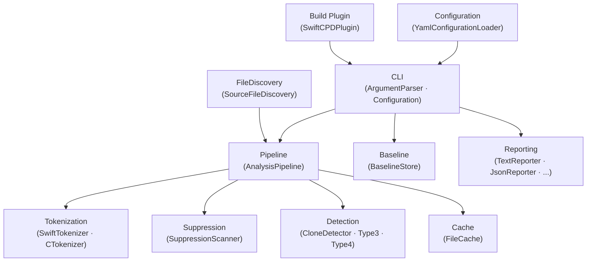
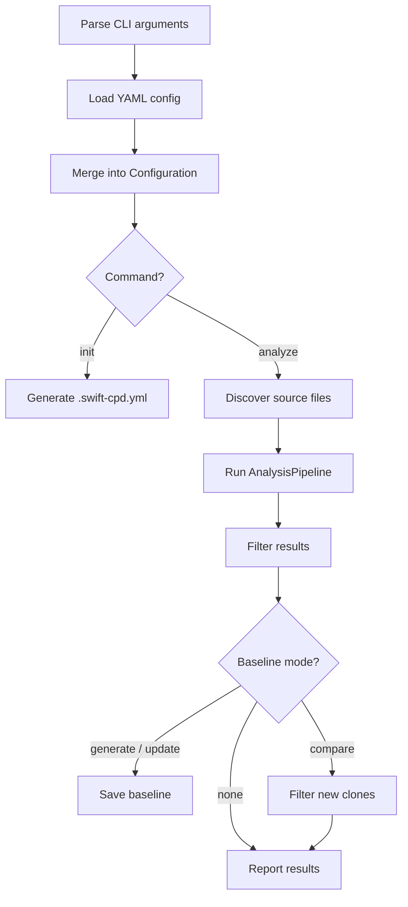

# Overview

← [Index](README.md) | Next: [Pipeline →](02-pipeline.md)

---

## Purpose

swift-cpd detects **code clones** — fragments of source code that are identical or semantically similar — across Swift and Objective-C/C projects. It supports four clone types, from verbatim duplicates to code that achieves the same result through different implementations.

## Module Map

The codebase is organized into independent modules. Each has a single responsibility and communicates through well-defined interfaces.

## Entry Point

`SwiftCPD.swift` is the `@main` entry point. It orchestrates the top-level sequence:

## Plugin Integration

`SwiftCPDPlugin` implements both `BuildToolPlugin` (SPM) and `XcodeBuildToolPlugin` (Xcode). When integrated into a project, it runs `swift-cpd` automatically during the build using the `xcode` output format, surfacing clones as Xcode build warnings.

---

← [Index](README.md) | Next: [Pipeline →](02-pipeline.md)
