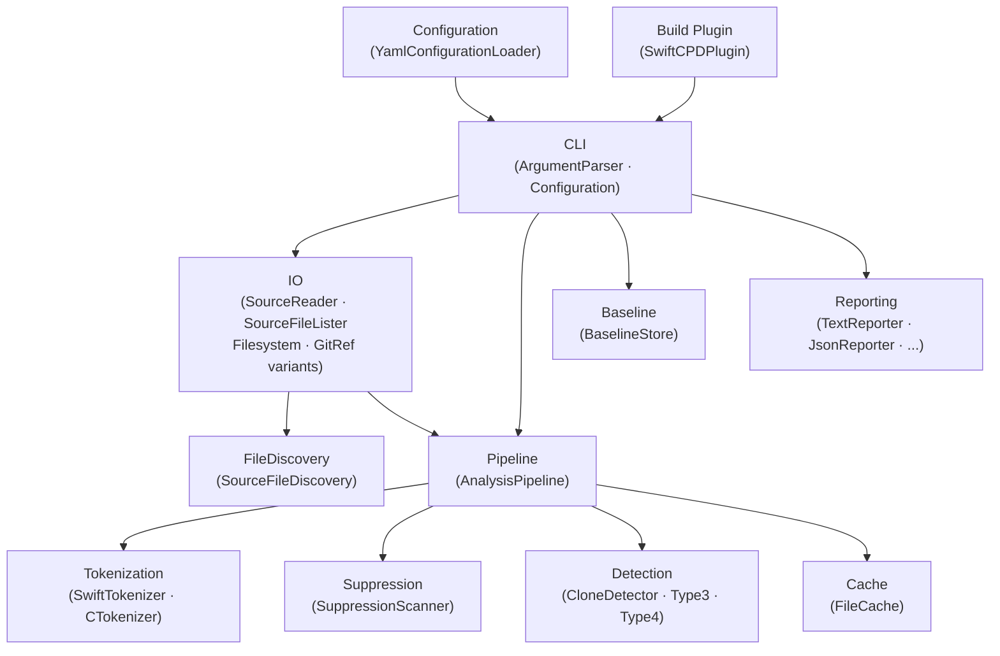
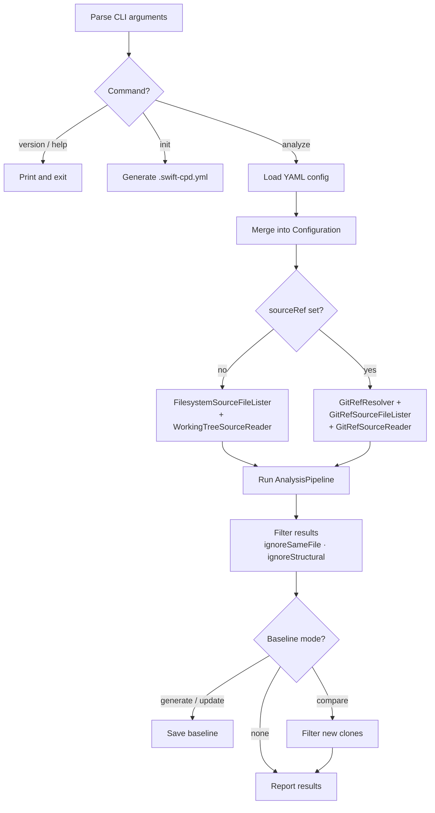

# Overview

← [Index](README.md) | Next: [Pipeline →](02-pipeline.md)

---

## Purpose

swift-cpd detects **code clones** — fragments of source code that are identical or semantically similar — across Swift and Objective-C/C projects. It supports four clone types, from verbatim duplicates to code that achieves the same result through different implementations.

## Module Map

The codebase is organized into independent modules. Each has a single responsibility and communicates through well-defined interfaces.

```mermaid
graph TD
    CLI["CLI<br/>(ArgumentParser · Configuration)"]
    YAML["Configuration<br/>(YamlConfigurationLoader)"]
    DISC["FileDiscovery<br/>(SourceFileDiscovery)"]
    IO["IO<br/>(SourceReader · SourceFileLister<br/>Filesystem · GitRef variants)"]
    PIPE["Pipeline<br/>(AnalysisPipeline)"]
    TOK["Tokenization<br/>(SwiftTokenizer · CTokenizer)"]
    SUP["Suppression<br/>(SuppressionScanner)"]
    DET["Detection<br/>(CloneDetector · Type3 · Type4)"]
    CACHE["Cache<br/>(FileCache)"]
    BASE["Baseline<br/>(BaselineStore)"]
    REP["Reporting<br/>(TextReporter · JsonReporter · ...)"]
    PLUGIN["Build Plugin<br/>(SwiftCPDPlugin)"]

    CLI --> IO
    CLI --> PIPE
    YAML --> CLI
    IO --> DISC
    IO --> PIPE
    PIPE --> TOK
    PIPE --> SUP
    PIPE --> DET
    PIPE --> CACHE
    CLI --> BASE
    CLI --> REP
    PLUGIN --> CLI
```

## Entry Point

`SwiftCPD.swift` is the `@main` entry point. It orchestrates the top-level sequence:

```mermaid
flowchart TD
    A[Parse CLI arguments] --> D{Command?}
    D -- version / help --> V[Print and exit]
    D -- init --> E[Generate .swift-cpd.yml]
    D -- analyze --> B[Load YAML config]
    B --> C[Merge into Configuration]
    C --> SIO{sourceRef set?}
    SIO -- no --> F1[FilesystemSourceFileLister<br/>+ WorkingTreeSourceReader]
    SIO -- yes --> F2[GitRefResolver +<br/>GitRefSourceFileLister<br/>+ GitRefSourceReader]
    F1 --> G[Run AnalysisPipeline]
    F2 --> G
    G --> H[Filter results<br/>ignoreSameFile · ignoreStructural]
    H --> I{Baseline mode?}
    I -- generate / update --> J[Save baseline]
    I -- compare --> K[Filter new clones]
    I -- none --> L[Report results]
    K --> L
```

`init`, `--version` and `--help` are handled before any configuration file is read. The YAML file is `--config <path>` when given, otherwise `.swift-cpd.yml` in the current directory if it exists.

## Plugin Integration

`SwiftCPDPlugin` implements both `BuildToolPlugin` (SPM) and `XcodeBuildToolPlugin` (Xcode). When integrated into a project, it runs `swift-cpd` automatically during the build using the `xcode` output format, surfacing clones as Xcode build warnings. The plugin passes a cache directory and a marker output file inside its plugin work directory (`--cache-dir`, `--output`); in `xcode` mode (without a baseline mode) the CLI prints the warnings to stdout, writes the empty marker file, and exits `0`.

---

← [Index](README.md) | Next: [Pipeline →](02-pipeline.md)
