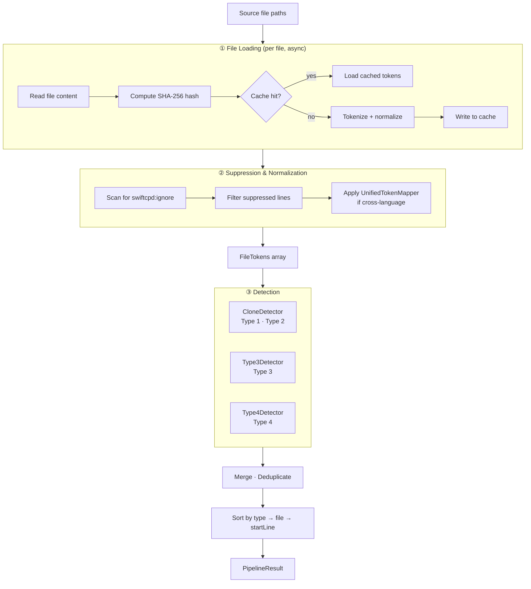

# Analysis Pipeline

← [Overview](01-overview.md) | Next: [Detection →](03-detection.md)

---

## Stages

`AnalysisPipeline` processes source files through five sequential stages. The first two stages (file loading and tokenization) run concurrently per file using Swift concurrency.



## Key Data Structures

### FileTokens

The central artifact produced by stage 1 and consumed by all detectors.

```
FileTokens
├── file          — absolute path
├── source        — raw source text
├── tokens        — original tokens (with real identifiers/literals)
└── normalizedTokens — tokens with $ID / $TYPE / $NUM / $STR placeholders
```

Both token lists are always co-indexed: `tokens[i]` and `normalizedTokens[i]` refer to the same source position.

### Token

```
Token
├── kind     — keyword · identifier · typeName · integerLiteral · ...
├── text     — original or normalized text
└── location — SourceLocation (file · line · column)
```

## Concurrency Model

| Component | Concurrency |
|---|---|
| File loading | `async/await`, tasks per file |
| `FileCache` | `actor` — serialized reads and writes |
| `ProgressReporter` | `actor` — serialized task tracking |
| Detectors | Called sequentially on the collected `FileTokens` |

The detectors themselves are pure value-type functions (`struct` conforming to `DetectionAlgorithm`) and require no synchronization.

## Configuration Thresholds

| Parameter | Default | Purpose |
|---|---|---|
| `minimumTokenCount` | 50 | Minimum clone size (in tokens) |
| `minimumLineCount` | 5 | Minimum clone size (in lines) |
| `type3Similarity` | 70% | Minimum GST similarity for Type 3 |
| `type3TileSize` | 5 | Minimum matching tile length |
| `type3CandidateThreshold` | 30% | Jaccard pre-filter for Type 3 |
| `type4Similarity` | 80% | Minimum combined similarity for Type 4 |

---

← [Overview](01-overview.md) | Next: [Detection →](03-detection.md)
