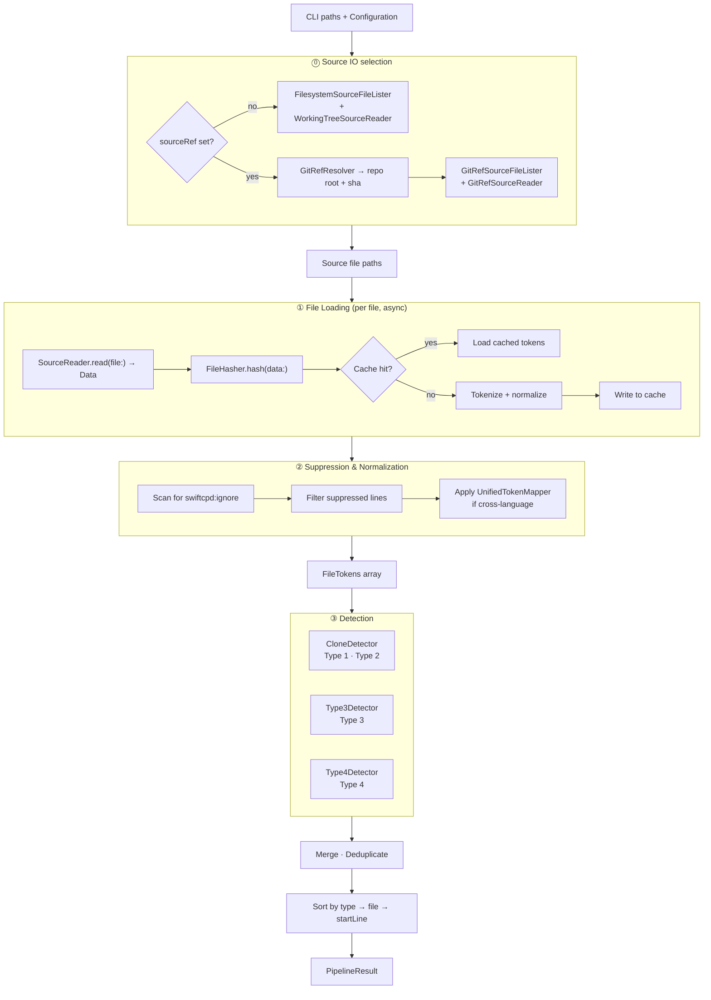

# Analysis Pipeline

← [Overview](01-overview.md) | Next: [Detection →](03-detection.md)

---

## Stages

`AnalysisPipeline` processes source files through six sequential stages. The first two analysis stages (file loading and tokenization) run concurrently per file using Swift concurrency.


```mermaid
flowchart TD
    A["CLI paths + Configuration"] --> SIO

    subgraph SIO["⓪ Source IO selection"]
        SIO1{sourceRef set?}
        SIO1 -- no --> SIO2["FilesystemSourceFileLister<br/>+ WorkingTreeSourceReader"]
        SIO1 -- yes --> SIO3["GitRefResolver → repo root + sha"]
        SIO3 --> SIO4["GitRefSourceFileLister<br/>+ GitRefSourceReader"]
    end

    SIO --> A1[Source file paths]
    A1 --> B

    subgraph B["① File Loading (per file, async)"]
        B1["SourceReader.read(file:) → Data"] --> B2["FileHasher.hash(data:)"]
        B2 --> B3{Cache hit?}
        B3 -- yes --> B4[Load cached tokens]
        B3 -- no --> B5[Tokenize + normalize]
        B5 --> B6[Write to cache]
    end

    B --> C

    subgraph C["② Suppression & Normalization"]
        C1[Scan for swiftcpd:ignore] --> C2[Filter suppressed lines]
        C2 --> C3[Apply UnifiedTokenMapper<br/>if cross-language]
    end

    C --> D[FileTokens array]

    D --> E

    subgraph E["③ Detection"]
        E1[CloneDetector<br/>Type 1 · Type 2]
        E2[Type3Detector<br/>Type 3]
        E3[Type4Detector<br/>Type 4]
    end

    E --> F[Merge · Deduplicate]
    F --> G["Sort by type → file → startLine"]
    G --> H[PipelineResult]
```

### Stage 0 — Source IO selection

Before the pipeline kicks in, `SwiftCPD.runAnalysis` picks the right source backends from `Configuration`:

| `sourceRef` | `SourceFileLister` | `SourceReader` | Cache key namespace |
|---|---|---|---|
| `nil` (default) | `FilesystemSourceFileLister` | `WorkingTreeSourceReader` | path only |
| `HEAD`, branch, sha | `GitRefSourceFileLister` | `GitRefSourceReader` | `<resolvedSha>\|<path>` |
| `:0` (index) | `GitRefSourceFileLister` | `GitRefSourceReader` | `:0\|<path>` |

The git variants shell out to `git ls-tree`/`git ls-files` for discovery and `git cat-file blob` for content. `GitRefResolver` runs `git rev-parse --show-toplevel` and `git rev-parse --verify <ref>` once, producing the repo root and a resolved sha that is reused for every file in the analysis.

## Key Data Structures

### FileTokens

The central artifact produced by stage 1 and consumed by all detectors.

```
FileTokens
├── file          — absolute path
├── source        — raw source text
├── tokens        — original tokens (with real identifiers/literals)
└── normalizedTokens — tokens with $ID / $TYPE / $NUM / $STR placeholders
```

Both token lists are always co-indexed: `tokens[i]` and `normalizedTokens[i]` refer to the same source position.

### Token

```
Token
├── kind     — keyword · identifier · typeName · integerLiteral · ...
├── text     — original or normalized text
└── location — SourceLocation (file · line · column)
```

## Concurrency Model

| Component | Concurrency |
|---|---|
| File loading | `async/await`, tasks per file |
| `FileCache` | `actor` — serialized reads and writes |
| `ProgressReporter` | `actor` — serialized task tracking |
| Detectors | Called sequentially on the collected `FileTokens` |

The detectors themselves are pure value-type functions (`struct` conforming to `DetectionAlgorithm`) and require no synchronization.

## Configuration Thresholds

| Parameter | Default | Purpose |
|---|---|---|
| `minimumTokenCount` | 50 | Minimum clone size (in tokens) |
| `minimumLineCount` | 5 | Minimum clone size (in lines) |
| `type3Similarity` | 70% | Minimum GST similarity for Type 3 |
| `type3TileSize` | 5 | Minimum matching tile length |
| `type3CandidateThreshold` | 30% | Jaccard pre-filter for Type 3 |
| `type4Similarity` | 80% | Minimum combined similarity for Type 4 |
| `sourceFileResolvedSha` | `nil` | When set, namespaces cache entries by this sha so runs against different refs don't collide |

---

← [Overview](01-overview.md) | Next: [Detection →](03-detection.md)
