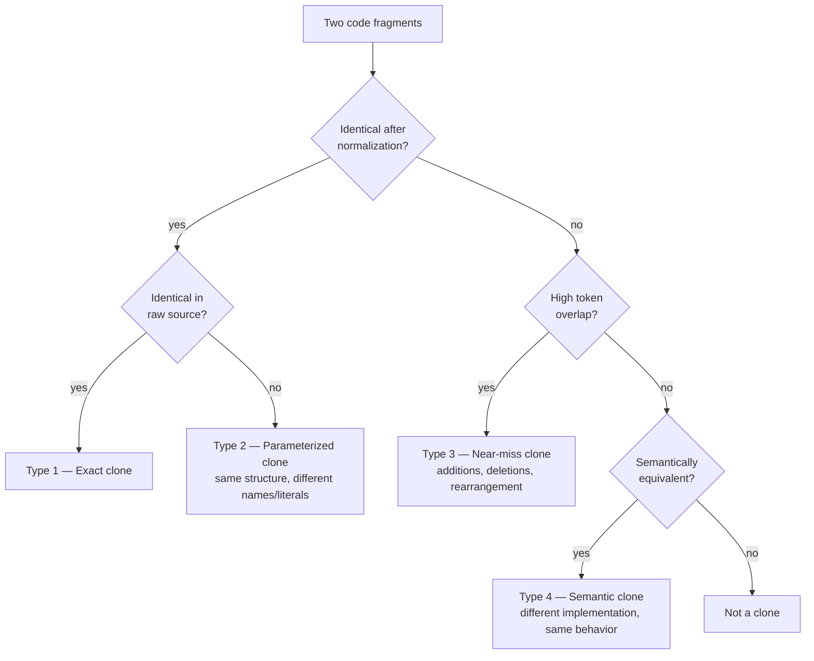
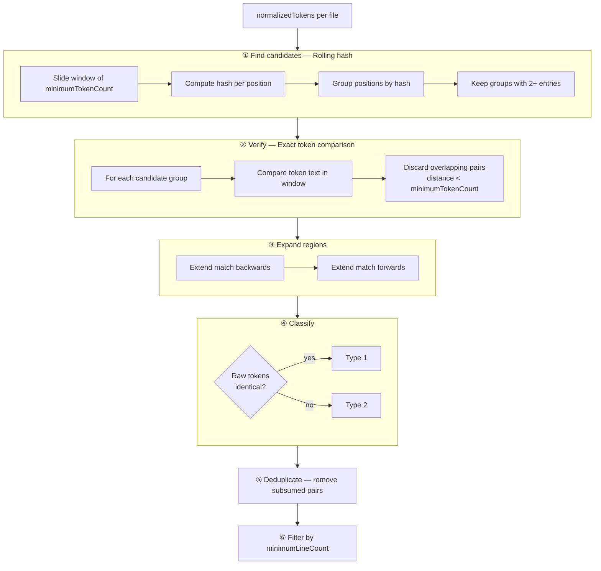
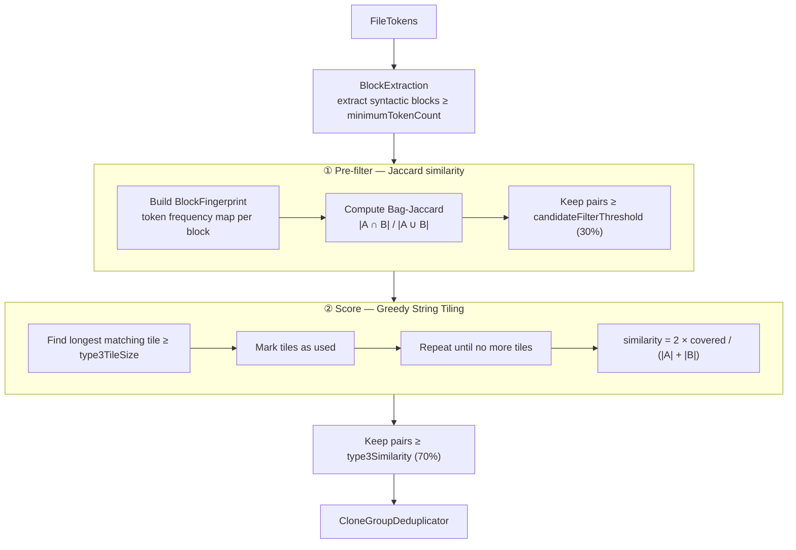
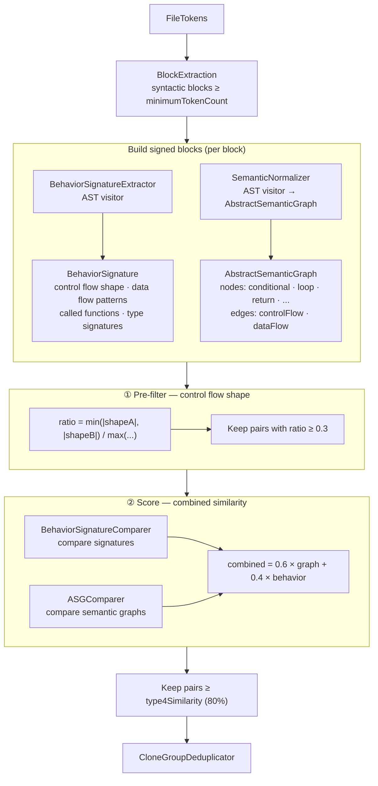

# Clone Detection

← [Pipeline](02-pipeline.md) | Next: [Tokenization →](04-tokenization.md)

---

## Clone Types



All detectors implement the `DetectionAlgorithm` protocol and receive the same `[FileTokens]` input. Their output is a list of `CloneGroup` values.

```
CloneGroup
├── type        — CloneType (1–4)
├── tokenCount  — length in tokens
├── lineCount   — length in lines
├── similarity  — 100.0 for Type 1/2, percentage for Type 3/4
└── fragments   — [CloneFragment] (exactly two per group)

CloneFragment
├── file
├── startLine · endLine
└── startColumn · endColumn
```

---

## Type 1 & 2 — CloneDetector

`CloneDetector` detects both exact and parameterized clones in a single pass over **normalized** tokens. Classification happens at the end by comparing raw tokens.



**Rolling hash:** polynomial hash with base 31 and modulus 10⁹+7. Updating the hash when sliding the window is O(1) per position, making the overall complexity O(n) per file.

---

## Type 3 — Near-Miss Clones

`Type3Detector` operates on **syntactic blocks** (functions, closures, control statements) rather than raw token streams. It uses a two-phase approach to keep the quadratic comparison cost manageable.



**Greedy String Tiling (GST):** finds the largest non-overlapping matching substrings between two token sequences. It is order-sensitive (unlike Jaccard), catching cases where blocks share a high proportion of common code but with some statements added, removed, or reordered.

---

## Type 4 — Semantic Clones

`Type4Detector` compares code behavior rather than token sequences. Each block is analyzed to produce two complementary representations.



### BehaviorSignature

Captures observable program behavior without regard to syntax:

- **Control flow shape** — ordered sequence of statement kinds (`if`, `guard`, `for`, `while`, `switch`, `do-catch`, `return`, `throw`, …)
- **Data flow patterns** — how variables are defined and used (`defineAndUse`, `defineOnly`, `parameterUse`, `useOnly`)
- **Called functions** — set of function names invoked
- **Type signatures** — type annotations referenced

### AbstractSemanticGraph (ASG)

A graph representation of control and data flow:

| Node kind | Meaning |
|---|---|
| `conditional` | `if`, `guard`, `switch` |
| `loop` | `for`, `while`, `repeat`, `forEach` |
| `returnValue` | `return` with value |
| `guardExit` | `guard-else-return/throw` |
| `optionalUnwrap` | `if let`, `guard let` |
| `errorHandling` | `do-catch`, `throw` |
| `collectionOperation` | `map`, `filter`, `reduce`, … |
| `assignment` | variable binding |
| `literalValue` | constant literal |
| `functionCall` | call expression |
| `parameterInput` | function parameter |

Edges carry a kind: `controlFlow` (sequential execution) or `dataFlow` (variable dependency).

---

← [Pipeline](02-pipeline.md) | Next: [Tokenization →](04-tokenization.md)
