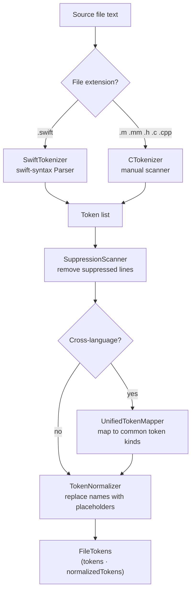

# Tokenization

← [Detection](03-detection.md) | Next: [Supporting Systems →](05-supporting-systems.md)

---

## Responsibilities

The tokenization layer transforms raw source text into the `FileTokens` structure consumed by all detectors. It consists of three steps: tokenization, normalization, and (optionally) unified mapping for cross-language analysis.



---

## Token

Every token carries three fields:

| Field | Type | Description |
|---|---|---|
| `kind` | `TokenKind` | Semantic classification |
| `text` | `String` | Exact source text |
| `location` | `SourceLocation` | file · line · column |

### TokenKind

```
keyword           — func, var, let, if, return, …
identifier        — variable and function names
typeName          — names in type positions
integerLiteral    — 42, 0xFF
floatingLiteral   — 3.14
stringLiteral     — "hello"
operatorToken     — +, -, ==, !=, …
punctuation       — (, ), {, }, [, ], ,, ;
```

---

## SwiftTokenizer

Uses the **swift-syntax** `Parser` to produce a full syntax tree from Swift source. Tokens are extracted from the tree walk and classified based on their syntactic role:

- An `identifier` token whose parent node is `IdentifierTypeSyntax` or `MemberTypeSyntax` is promoted to `typeName`.
- All other structural positions default to `identifier`.

This classification allows `TokenNormalizer` to produce distinct placeholders for names (`$ID`) and types (`$TYPE`), improving the precision of Type 1/2 matching.

---

## CTokenizer

A manual state-machine scanner for C, Objective-C, and C++ sources (`.m`, `.mm`, `.h`, `.c`, `.cpp`). It handles:

- C preprocessor directives (`#import`, `#define`)
- Objective-C message sends (`[receiver message]`)
- C++ templates and namespaces
- Multi-line strings and block comments

---

## TokenNormalizer

Replaces token text with language-agnostic placeholders:

| Original | Placeholder | Applies to |
|---|---|---|
| Any identifier | `$ID` | `identifier` |
| Any type name | `$TYPE` | `typeName` |
| Any integer literal | `$NUM` | `integerLiteral` |
| Any float literal | `$NUM` | `floatingLiteral` |
| Any string literal | `$STR` | `stringLiteral` |

Keywords, operators, and punctuation are preserved as-is.

After normalization, `var x = 5` and `var y = 10` produce the same token sequence: `var $ID = $NUM`. This is what enables Type 2 detection.

---

## UnifiedTokenMapper

When `--cross-language` is enabled, both Swift and C-family tokens are mapped to a common vocabulary before normalization. This allows the detectors to find clones across language boundaries, such as a Swift class and its Objective-C counterpart.

---

## SuppressionScanner

Scans source text for the suppression tag (default `swiftcpd:ignore`) and returns the set of line numbers that should be excluded from analysis.

**Block suppression:** the tag on the line immediately before a `{...}` block suppresses all lines within that block.

**Line suppression:** the tag on any other line suppresses only that line.

Tokens whose `location.line` falls in the suppressed set are removed before normalization, so they are invisible to all detectors.

---

← [Detection](03-detection.md) | Next: [Supporting Systems →](05-supporting-systems.md)
