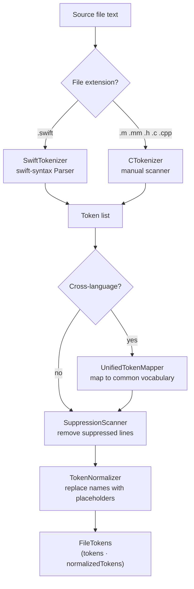

# Tokenization

← [Detection](03-detection.md) | Next: [Supporting Systems →](05-supporting-systems.md)

---

## Responsibilities

The tokenization layer transforms raw source text into the `FileTokens` structure consumed by all detectors. It consists of four steps: tokenization, (optionally) unified mapping for cross-language analysis, inline suppression, and normalization.


```mermaid
flowchart TD
    SRC[Source file text]
    SRC --> SW{File extension?}
    SW -- .swift --> ST[SwiftTokenizer<br/>swift-syntax Parser]
    SW -- .m .mm .h .c .cpp --> CT[CTokenizer<br/>manual scanner]
    ST --> TK[Token list]
    CT --> TK
    TK --> UM{Cross-language?}
    UM -- yes --> MP[UnifiedTokenMapper<br/>map to common vocabulary]
    UM -- no --> SS
    MP --> SS[SuppressionScanner<br/>remove suppressed lines]
    SS --> NM[TokenNormalizer<br/>replace names with placeholders]
    NM --> FT["FileTokens<br/>(tokens · normalizedTokens)"]
```

---

## Token

Every token carries three fields:

| Field | Type | Description |
|---|---|---|
| `kind` | `TokenKind` | Semantic classification |
| `text` | `String` | Exact source text |
| `location` | `SourceLocation` | file · line · column |

### TokenKind

```
keyword           — func, var, let, if, return, …
identifier        — variable and function names
typeName          — names in type positions
integerLiteral    — 42, 0xFF
floatingLiteral   — 3.14
stringLiteral     — "hello"
operatorToken     — +, -, ==, !=, …
punctuation       — (, ), {, }, [, ], ,, ;, :, ., ::
```

---

## SwiftTokenizer

Uses the **swift-syntax** `Parser` to produce a full syntax tree from Swift source. Tokens are extracted from the tree walk and classified based on their syntactic role:

- An `identifier` token whose parent node is `IdentifierTypeSyntax` or `MemberTypeSyntax` is promoted to `typeName`.
- An `identifier` token whose parent is a `DeclReferenceExprSyntax` that is the callee of a `FunctionCallExprSyntax` is also promoted to `typeName`. This covers constructor and function call names (e.g., `Color(...)`, `GridToken(...)`).
- All other structural positions default to `identifier`.

This classification allows `TokenNormalizer` to preserve type and callee names while replacing regular identifiers, improving the precision of Type 2 matching and reducing false positives between structurally similar but semantically unrelated code.

---

## CTokenizer

A manual state-machine scanner for C, Objective-C, and C++ sources (`.m`, `.mm`, `.h`, `.c`, `.cpp`). It handles:

- C preprocessor directives (`#import`, `#define`, …) — skipped up to the end of the line, producing no tokens
- Line (`//`) and block (`/* */`) comments — skipped
- Objective-C `@` keywords (`@interface`, `@property`, …) as `keyword`, and `@"..."` strings as `stringLiteral`
- String literals and character literals (the latter emitted as `integerLiteral`)
- Words classified by `CLanguageVocabulary`: C/Objective-C keywords → `keyword`; known Foundation types (`NSString`, `NSInteger`, …) or capitalized words → `typeName`; everything else → `identifier`

---

## TokenNormalizer

Replaces token text with language-agnostic placeholders:

| Original | Placeholder | Applies to |
|---|---|---|
| Any identifier | `$ID` | `identifier` |
| Any integer literal | `$NUM` | `integerLiteral` |
| Any float literal | `$NUM` | `floatingLiteral` |
| Any string literal | `$STR` | `stringLiteral` |

Type names, function/constructor callee names, keywords, operators, and punctuation are preserved as-is. This means `Color(r: 0)` and `GridToken(columns: 2)` produce different normalized sequences, preventing false positives between code that shares structural patterns but uses different types.

After normalization, `var x = 5` and `var y = 10` produce the same token sequence: `var $ID = $NUM`. This is what enables Type 2 detection.

---

## UnifiedTokenMapper

When `--cross-language` is enabled, both Swift and C-family tokens are mapped to a common vocabulary before suppression and normalization. This allows the detectors to find clones across language boundaries, such as a Swift class and its Objective-C counterpart.

- **Types:** Foundation types become their Swift equivalents (`NSString`/`NSMutableString` → `String`, `NSInteger`/`NSUInteger`/`CGFloat` → `Int`, `BOOL` → `Bool`, `NSObject`/`id` → `AnyObject`); collection types (`Array`, `NSArray`, `Dictionary`, `NSDictionary`, `Set`, `NSSet`, …) become `$COLLECTION_TYPE`.
- **Keywords:** `YES`/`NO` → `true`/`false`, `@interface`/`@implementation` → `class`, `@property` → `var`.
- **Patterns:** Objective-C message sends with arguments (`[obj msg:arg]`) and `identifier(` calls become `$CALL`; argument-less message sends (`[obj prop]`) and `a.b` property accesses become `$ACCESS`.

---

## SuppressionScanner

Scans source text for the suppression tag (default `swiftcpd:ignore`) and returns the set of line numbers that should be excluded from analysis. The tag is recognized only at the start of a `//` or `/*` comment line (leading whitespace allowed). It applies to the next non-blank line after the comment:

**Block suppression:** if that line contains `{`, every line up to the matching `}` is suppressed.

**Line suppression:** otherwise only that single line is suppressed.

Tokens whose `location.line` falls in the suppressed set are removed before normalization (and before the result is cached), so they are invisible to all detectors.

---

← [Detection](03-detection.md) | Next: [Supporting Systems →](05-supporting-systems.md)
