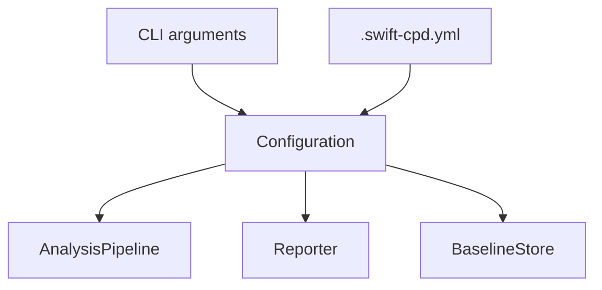
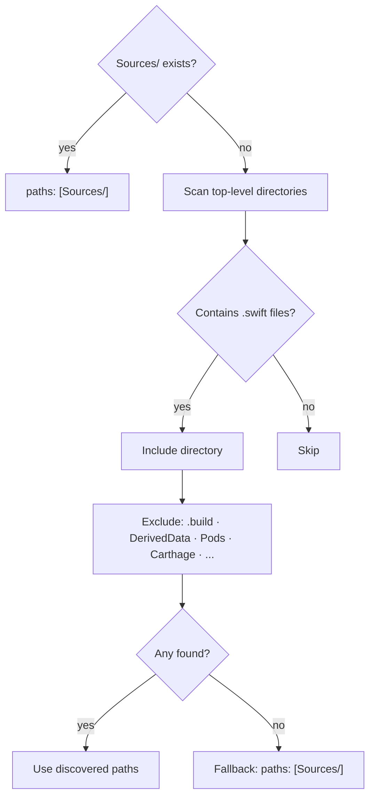
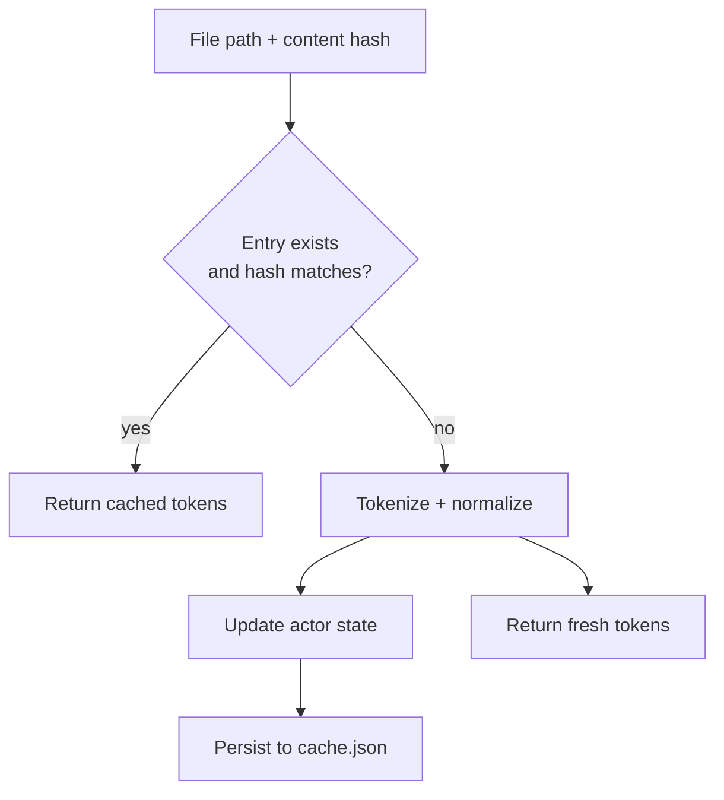
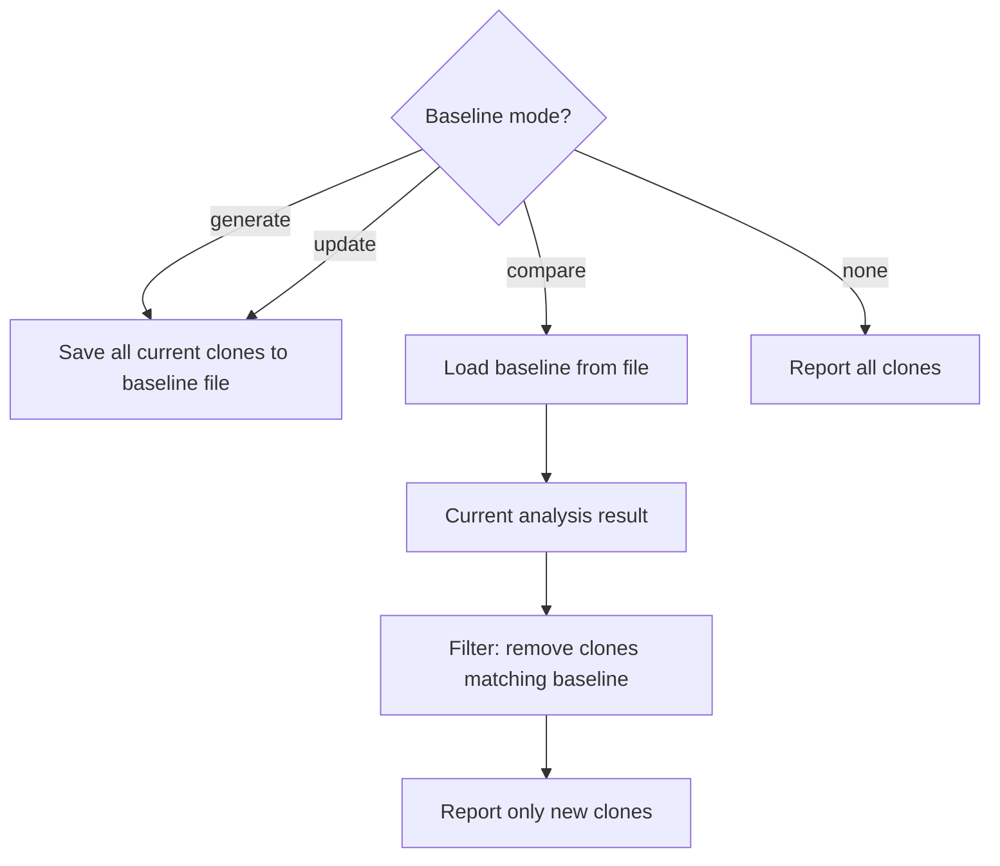
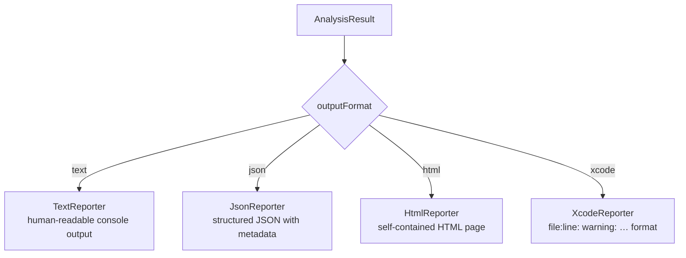

# Supporting Systems

← [Tokenization](04-tokenization.md) | [Index →](README.md)

---

## Configuration

Configuration is assembled from two sources that are merged, with CLI arguments taking precedence over the YAML file.



**`YamlConfigurationParser`** is a zero-dependency YAML parser. It handles scalar values (strings, integers, booleans) and single-level lists. There is no external YAML library.

### Key Configuration Fields

| Field | Default | Description |
|---|---|---|
| `paths` | _(required)_ | Source directories to analyze |
| `minimumTokenCount` | 50 | Smallest clone in tokens |
| `minimumLineCount` | 5 | Smallest clone in lines |
| `outputFormat` | `text` | `text` · `json` · `html` · `xcode` |
| `enabledCloneTypes` | `[1,2,3,4]` | Which clone types to run |
| `ignoreSameFile` | `true` | Skip clones within a single file |
| `ignoreStructural` | `true` | Skip Type 3 and Type 4 clones |
| `crossLanguageEnabled` | `false` | Include Objective-C/C files |
| `inlineSuppressionTag` | `swiftcpd:ignore` | Comment tag to suppress a region |
| `maxDuplication` | _(none)_ | Fail if duplication % exceeds this |
| `baselineFilePath` | `.swift-cpd-baseline.json` | Baseline file location |
| `cacheDirectory` | `.swift-cpd-cache` | Token cache directory |

### `init` Command — Source Path Discovery

`swift-cpd init` generates a starter `.swift-cpd.yml` with the `paths` field set automatically by `SourcePathDiscovery`:



---

## Cache

`FileCache` is an `actor` that stores tokenization results on disk. It eliminates redundant tokenization on unchanged files.



**Cache entry:**

```
CacheEntry
├── contentHash  — SHA-256 of file contents
├── tokens       — original Token list
└── normalizedTokens — normalized Token list
```

The cache is stored at `.swift-cpd-cache/cache.json` (configurable). I/O operations are offloaded to a `Task.detached` to avoid blocking the actor while the caller awaits the result.

---

## Baseline

The baseline system enables incremental analysis: only clones introduced since the last recorded state are reported.



### Matching Strategy

Clones are identified in the baseline by a `FragmentFingerprint` (file path + start/end lines), not by exact byte positions. This makes the baseline tolerant of minor source edits that shift line numbers within unchanged code.

**BaselineEntry:**

```
BaselineEntry
├── type                 — clone type (1–4)
├── tokenCount
├── lineCount
└── fragmentFingerprints — [FragmentFingerprint]
                           (file · startLine · endLine)
```

---

## Reporting

All reporters implement the `Reporter` protocol and receive a single `AnalysisResult` value.



**`AnalysisResult`** contains:
- `cloneGroups` — sorted by type → token count → file → line
- `filesAnalyzed`, `executionTime`, `totalTokens`
- `minimumTokenCount`, `minimumLineCount` (for context in reports)

**`DuplicationCalculator`** computes the percentage: `duplicatedTokens / totalTokens × 100`. When `maxDuplication` is configured, the exit code becomes `1` (clonesDetected) if this percentage is exceeded.

### JSON Report Structure

```
JsonReport
├── metadata     — tool version, timestamp, execution time
├── configuration — thresholds and flags used
├── summary      — total clones, files, duplication %
├── byType       — clone counts grouped by type
└── clones[]
    ├── type · similarity · tokenCount · lineCount
    └── fragments[]
        ├── file · startLine · endLine
        └── preview  — source lines for context
```

---

← [Tokenization](04-tokenization.md) | [Index →](README.md)
