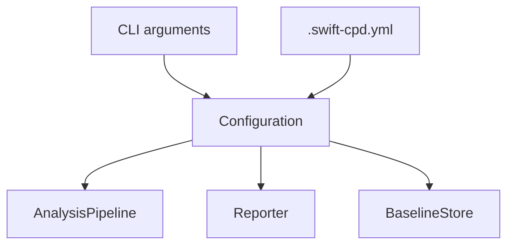
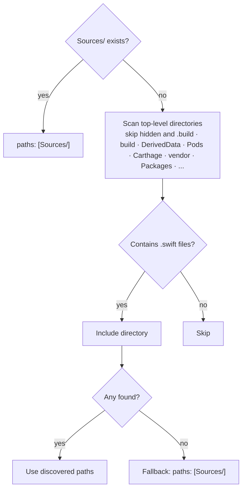
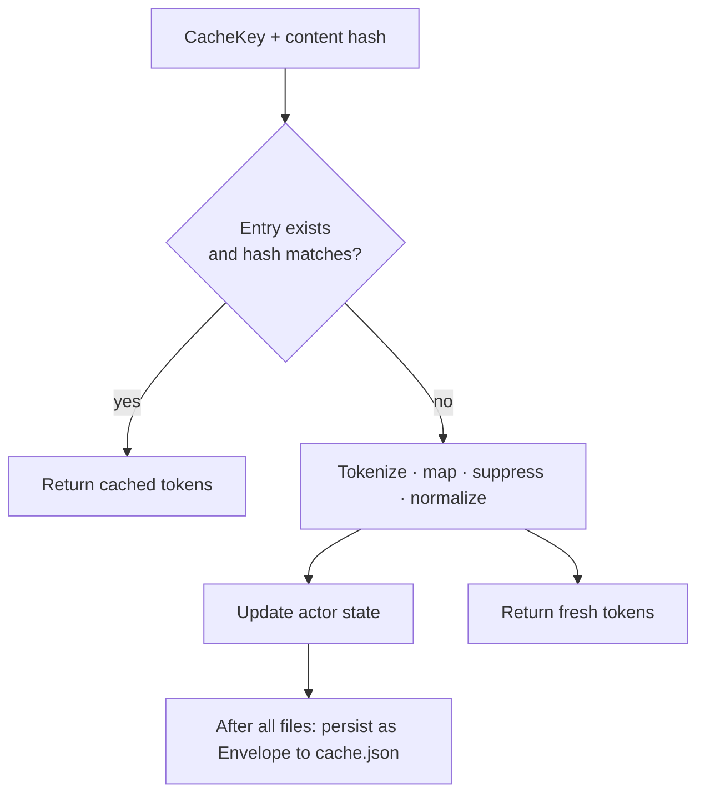
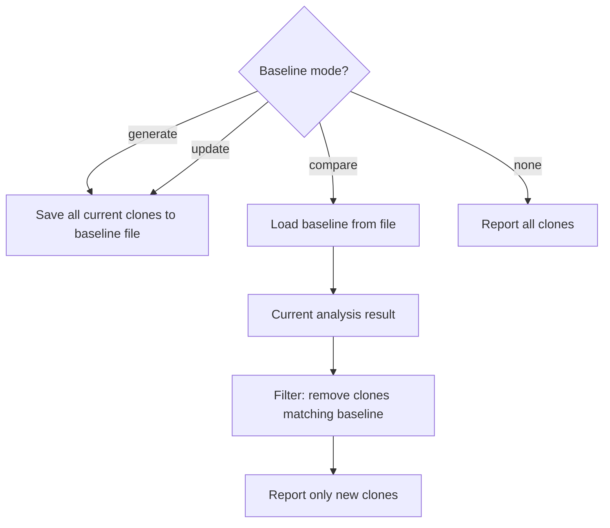
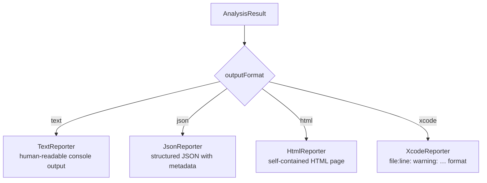

# Supporting Systems

← [Tokenization](04-tokenization.md) | [Index →](README.md)

---

## Configuration

Configuration is assembled from two sources that are merged, with CLI arguments taking precedence over the YAML file. Boolean switches (`--cross-language`, `--ignore-same-file`, `--ignore-structural`, `--no-cache`) are OR-ed with their YAML counterparts, and `--exclude` patterns are appended to the YAML `exclude` list. Numeric thresholds are range-checked after merging; an out-of-range value is a configuration error (exit `2`).


```mermaid
flowchart TD
    A[CLI arguments] --> C[Configuration]
    B[".swift-cpd.yml"] --> C
    C --> D[AnalysisPipeline]
    C --> E[Reporter]
    C --> F[BaselineStore]
```

**`YamlConfigurationParser`** is a zero-dependency YAML parser. It handles scalar values (strings, integers, booleans) and single-level lists. There is no external YAML library.

### Key Configuration Fields

| Field | Default | Description |
|---|---|---|
| `paths` | _(required)_ | Source directories to analyze |
| `minimumTokenCount` | 50 | Smallest clone in tokens (10–500) |
| `minimumLineCount` | 5 | Smallest clone in lines (2–100) |
| `outputFormat` | `text` | `text` · `json` · `html` · `xcode` |
| `outputFilePath` | _(stdout)_ | Report destination (`--output`, CLI only) |
| `enabledCloneTypes` | `[1,2,3,4]` | Which clone types to run |
| `type3Similarity` · `type3TileSize` · `type3CandidateThreshold` | 70 · 5 · 30 | Type 3 thresholds (50–100 · 2–20 · 10–80) |
| `type4Similarity` | 80 | Type 4 threshold (60–100) |
| `exclude` | `[]` | Glob patterns of files to skip (`excludePatterns`) |
| `ignoreSameFile` | `false` | Skip clones within a single file |
| `ignoreStructural` | `false` | Skip Type 3 and Type 4 clones |
| `crossLanguageEnabled` | `false` | Include Objective-C/C files |
| `inlineSuppressionTag` | `swiftcpd:ignore` | Comment tag to suppress a region |
| `maxDuplication` | _(none)_ | Fail if duplication % exceeds this |
| `baselineFilePath` | `.swift-cpd-baseline.json` | Baseline file location (`--baseline`, CLI only) |
| `noCache` | `false` | Disable tokenization cache |
| `cacheDirectory` | `.swift-cpd-cache` | Token cache directory (`--cache-dir`, CLI only) |
| `sourceRef` | _(none)_ | Git ref to read sources from (`HEAD`, branch, sha, `:0`); empty means working tree |

The `.swift-cpd.yml` generated by `swift-cpd init` sets `ignoreSameFile: true` and `ignoreStructural: true` explicitly.

### `init` Command — Source Path Discovery

`swift-cpd init` generates a starter `.swift-cpd.yml` with the `paths` field set automatically by `SourcePathDiscovery`:


```mermaid
flowchart TD
    A{Sources/ exists?} -- yes --> B["paths: [Sources/]"]
    A -- no --> C[Scan top-level directories<br/>skip hidden and .build · build · DerivedData · Pods · Carthage · vendor · Packages · ...]
    C --> D{Contains .swift files?}
    D -- yes --> E[Include directory]
    D -- no --> F[Skip]
    E --> H{Any found?}
    H -- yes --> I[Use discovered paths]
    H -- no --> J["Fallback: paths: [Sources/]"]
```

---

## Cache

`FileCache` is an `actor` that stores tokenization results on disk. It eliminates redundant tokenization on unchanged files.


```mermaid
flowchart TD
    A[CacheKey + content hash] --> B{Entry exists<br/>and hash matches?}
    B -- yes --> C[Return cached tokens]
    B -- no --> D[Tokenize · map · suppress · normalize]
    D --> E[Update actor state]
    E --> F[After all files: persist as Envelope to cache.json]
    D --> G[Return fresh tokens]
```

**Cache key:**

```
CacheKey
├── file        — absolute path
└── resolvedSha — nil (working tree) or the git sha when --source-ref is set (literal ":0" for the index)

  encoded → "<resolvedSha>|<path>"  when sha is non-nil
            "<path>"                 when sha is nil
```

The composite key lets entries from different source refs coexist in the same cache without collision. The working-tree namespace lives at the top level (no `|`); each git ref gets its own namespace prefixed by the resolved sha.

**Cache entry:**

```
CacheEntry
├── contentHash       — SHA-256 of file contents
├── tokens            — original Token list
└── normalizedTokens  — normalized Token list
```

**On-disk envelope (schema v2):**

```
Envelope
├── schemaVersion: 2
└── entries: [String: CacheEntry]   // keyed by CacheKey.encoded
```

The cache is stored at `.swift-cpd-cache/cache.json` (configurable via `--cache-dir`). I/O operations are offloaded to a `Task.detached` to avoid blocking the actor while the caller awaits the result.

Caching can be disabled entirely with `--no-cache` or `noCache: true` in the YAML file. When disabled, files are re-tokenized on every run and no cache is read or written.

### Schema versioning

The on-disk format is wrapped in a versioned envelope. On load, if `schemaVersion` does not match the current version, the cache is **silently discarded** — the next run pays one full tokenization pass, then steady state resumes. There is no migration path between schemas. Pre-v2 files (raw `[String: CacheEntry]`) fail to decode as `Envelope` and are likewise discarded.

---

## Baseline

The baseline system enables incremental analysis: only clones introduced since the last recorded state are reported.


```mermaid
flowchart TD
    A{Baseline mode?}
    A -- generate --> B[Save all current clones to baseline file]
    A -- update --> B
    A -- compare --> C[Load baseline from file]
    C --> D[Current analysis result]
    D --> E[Filter: remove clones matching baseline]
    E --> F[Report only new clones]
    A -- none --> G[Report all clones]
```

### Matching Strategy

Each clone group is converted to a `BaselineEntry` (clone type, token count, line count and one `FragmentFingerprint` per fragment: file path + start/end lines, no columns). A current clone is considered known only if an identical entry exists in the baseline (set membership on the whole entry), so any edit that changes a fragment's line range or the clone's size makes it reported as new. A missing baseline file is treated as an empty baseline.

**BaselineEntry:**

```
BaselineEntry
├── type                 — clone type (1–4)
├── tokenCount
├── lineCount
└── fragmentFingerprints — [FragmentFingerprint]
                           (file · startLine · endLine)
```

---

## Reporting

All reporters implement the `Reporter` protocol and receive a single `AnalysisResult` value.


```mermaid
flowchart TD
    AR[AnalysisResult] --> SEL{outputFormat}
    SEL -- text --> TR[TextReporter<br/>human-readable console output]
    SEL -- json --> JR[JsonReporter<br/>structured JSON with metadata]
    SEL -- html --> HR[HtmlReporter<br/>self-contained HTML page]
    SEL -- xcode --> XR[XcodeReporter<br/>file:line: warning: … format]
```

**`AnalysisResult`** contains:
- `cloneGroups` — after `ignoreSameFile` / `ignoreStructural` filtering (and, in compare mode, only new clones); reporters read `sortedCloneGroups`, ordered by type → token count (descending) → file → line
- `filesAnalyzed`, `executionTime`, `totalTokens`
- `minimumTokenCount`, `minimumLineCount` (for context in reports)
- `filteredCloneCount` — clones removed by the `ignoreSameFile` / `ignoreStructural` filters
- `sourceRef`, `resolvedSha` — set only when a source ref is configured (`--source-ref` or YAML `sourceRef`)

**`DuplicationCalculator`** computes the percentage: `duplicatedTokens / totalTokens × 100`, rounded to one decimal, where `duplicatedTokens` is the sum of the reported groups' `tokenCount`. When `maxDuplication` is configured, the exit code becomes `1` (clonesDetected) only if this percentage is exceeded; without `maxDuplication`, any reported clone yields `1`. Outside baseline modes, the `xcode` format always exits `0` and ignores `maxDuplication`.

### JSON Report Structure

```
JsonReport
├── clones[]
│   ├── id · type · similarity · tokenCount · lineCount
│   └── fragments[]
│       ├── file · startLine · endLine · startColumn · endColumn
│       └── preview  — first source line of the fragment
├── metadata     — configuration (minimumTokenCount · minimumLineCount), execution time, files analyzed, timestamp, total tokens
├── summary      — clone counts by type, duplicated lines/tokens, duplication %, total clones
├── version      — tool version
└── sourceRef · resolvedSha — only when a source ref is set (--source-ref or YAML sourceRef)
```

---

← [Tokenization](04-tokenization.md) | [Index →](README.md)
