# Architecture

## Overview

Swift CPD is a Clone & Pattern Detector for Swift (and optionally C-family languages) that identifies four types of code clones. It follows a **Pipeline (Pipe and Filter)** architecture where each stage receives input from the previous stage and produces output for the next.

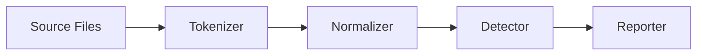

---

## Project Structure

### Module Dependencies

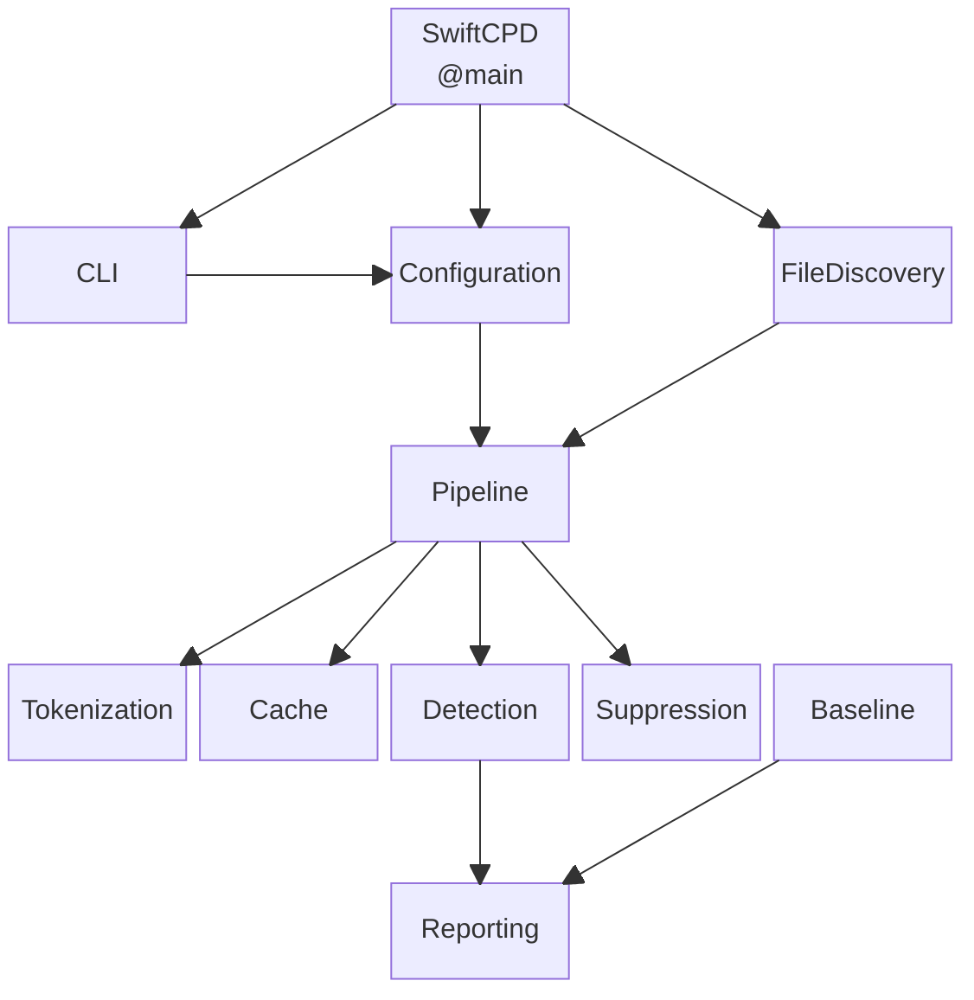

### Directory Layout

```text
Sources/SwiftCPD/
├── SwiftCPD.swift                 @main entry point
├── Version.swift
├── CLI/                           Argument parsing and configuration
├── Configuration/                 YAML configuration support
├── FileDiscovery/                 Recursive file discovery
├── Pipeline/                      Pipeline orchestration
├── Tokenization/                  Swift and C-family tokenizers
├── Detection/                     Clone detection algorithms
│   └── SemanticGraph/             Abstract Semantic Graph (Type-4)
├── Reporting/                     Output formatters
├── Cache/                         File-based tokenization cache
├── Baseline/                      Baseline comparison system
└── Suppression/                   Inline suppression scanning
```

### Modules

| Module | Key Types | Responsibility |
|--------|-----------|----------------|
| **CLI** | `ArgumentParser`, `ParsedArguments`, `Configuration`, `HelpText`, `ExitCode`, `OutputFormat` | Parses CLI arguments, merges with YAML config, validates parameters |
| **Configuration** | `YamlConfiguration`, `YamlConfigurationLoader` | Loads `.swift-cpd.yml` configuration files via Yams |
| **FileDiscovery** | `SourceFileDiscovery`, `GlobMatcher` | Recursively finds `.swift` and C-family files, applies exclusion patterns |
| **Pipeline** | `AnalysisPipeline`, `PipelineResult`, `ProgressReporter`, `ProgressState` | Orchestrates tokenization, detection, and caching stages |
| **Tokenization** | `SwiftTokenizer`, `CTokenizer`, `TokenNormalizer`, `UnifiedTokenMapper`, `Token`, `TokenKind`, `SourceLocation` | Tokenizes source code, normalizes tokens, maps cross-language equivalents |
| **Detection** | `CloneDetector`, `Type3Detector`, `Type4Detector`, `CloneGroup`, `CloneFragment`, `CloneType`, `FileTokens`, `CloneGroupBuilder`, `CloneGroupDeduplicator`, `IndexedBlock`, `SignedBlock` | Implements Type-1 through Type-4 clone detection algorithms |
| **Detection/SemanticGraph** | `AbstractSemanticGraph`, `SemanticNode`, `SemanticEdge`, `SemanticNormalizer`, `ASGComparer` | Builds and compares abstract semantic graphs for Type-4 detection |
| **Reporting** | `TextReporter`, `JsonReporter`, `HtmlReporter`, `XcodeReporter`, `AnalysisResult`, `DuplicationCalculator` | Formats analysis results into text, JSON, HTML, or Xcode warnings |
| **Cache** | `FileCache`, `CacheEntry`, `FileHasher` | Actor-based tokenization cache with SHA-256 keying |
| **Baseline** | `BaselineStore`, `BaselineEntry`, `FragmentFingerprint` | Stores known clones for incremental adoption |
| **Suppression** | `SuppressionScanner` | Scans for `// swiftcpd:ignore` comments to suppress regions |

---

## Pipeline Flow

The pipeline has three phases: **Setup**, **Analysis**, and **Output**.

### 1. Setup Phase

Parses CLI arguments, loads optional YAML configuration, discovers source files.

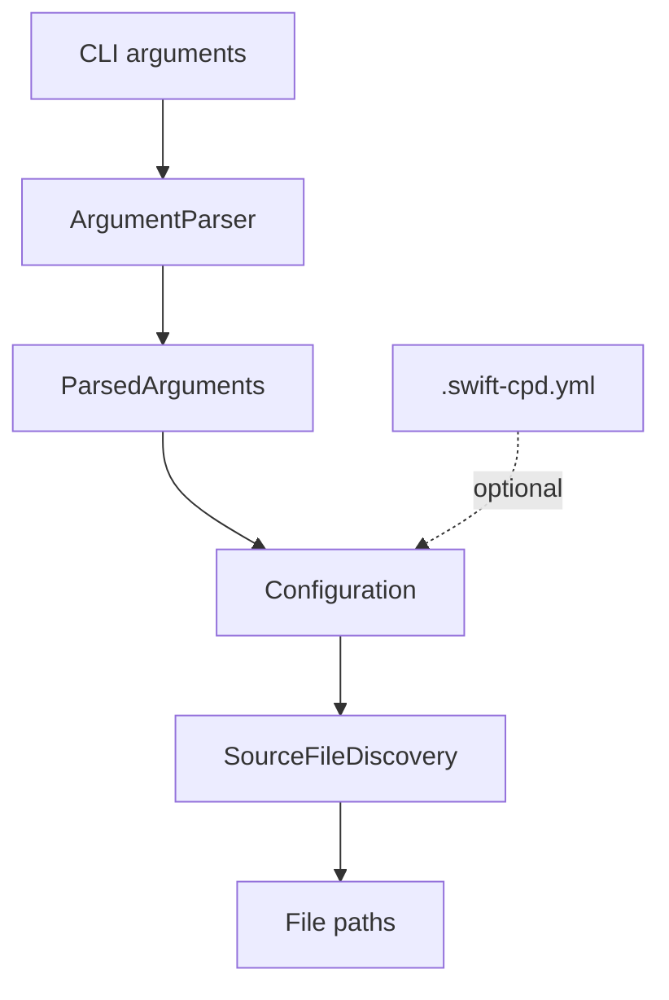

### 2. Analysis Phase

Tokenizes files in parallel, caches results, runs detection algorithms.

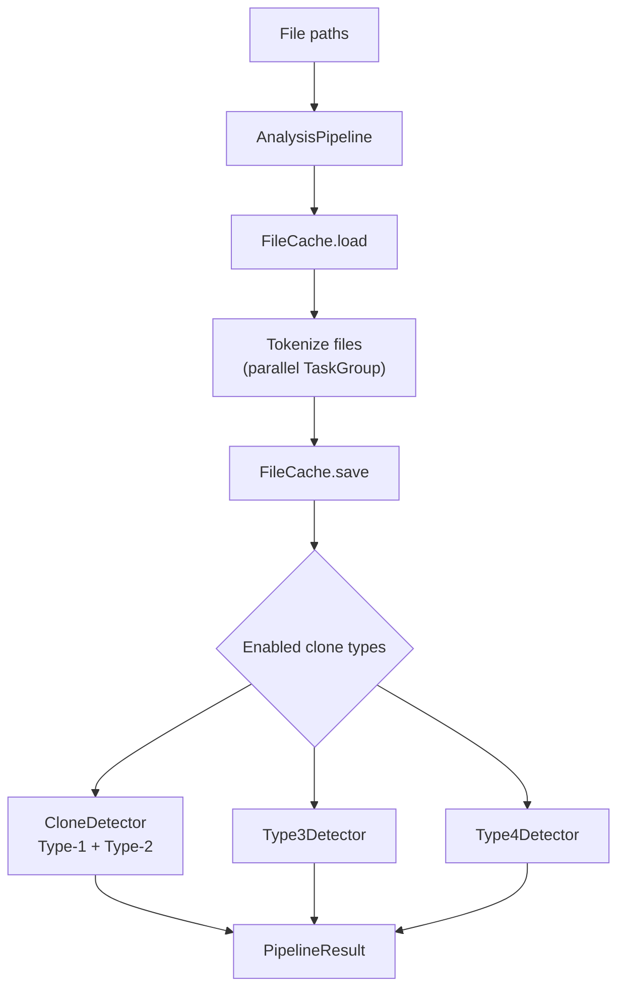

### 3. Output Phase

Applies post-detection filters, baseline filtering, formats results, writes output.

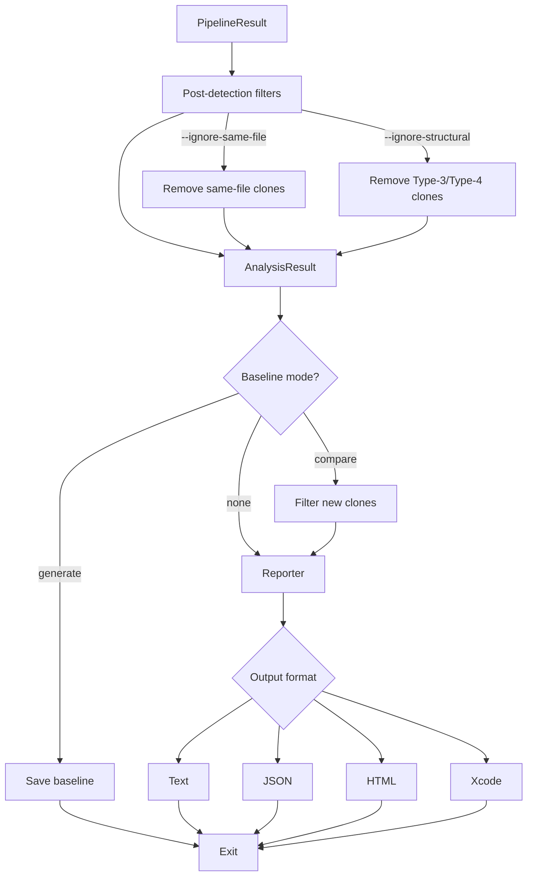

---

## Tokenization Stage

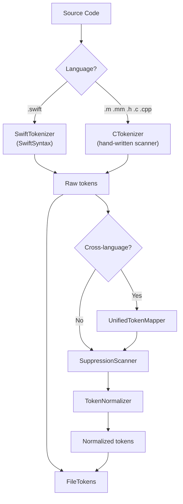

### Token Normalization

The `TokenNormalizer` replaces variable parts of the code with placeholders, enabling detection of structurally identical code with different names or values.

| Token Kind | Example | Normalized |
|------------|---------|------------|
| Identifier | `myVariable` | `$ID` |
| Type Name | `String` | `$TYPE` |
| Integer Literal | `42` | `$NUM` |
| Float Literal | `3.14` | `$NUM` |
| String Literal | `"hello"` | `$STR` |
| Keyword | `func` | `func` (unchanged) |
| Operator | `+` | `+` (unchanged) |
| Punctuation | `{` | `{` (unchanged) |

### Cross-Language Token Mapping

When `--cross-language` is enabled, `UnifiedTokenMapper` maps C/Objective-C tokens to Swift equivalents.

| C/Objective-C | Swift Equivalent |
|----------------|------------------|
| `NSString` | `String` |
| `BOOL` | `Bool` |
| `NSInteger` | `Int` |
| `YES` / `NO` | `true` / `false` |
| `@property` | `var` |
| `[obj method:arg]` | `$CALL` |

---

## Detection Algorithms

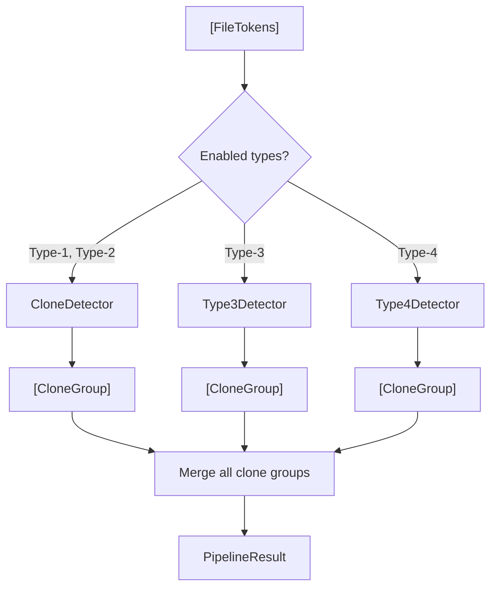

### Type-1: Exact Clones

Identical code fragments (ignoring whitespace and formatting).

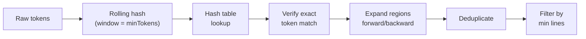

### Type-2: Parameterized Clones

Structurally identical code with different identifiers, literals, or types.

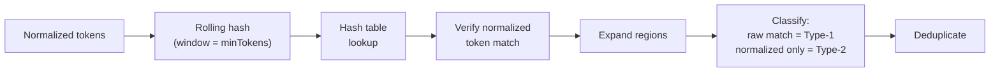

### Type-3: Gapped Clones

Similar code with insertions, deletions, or modifications.

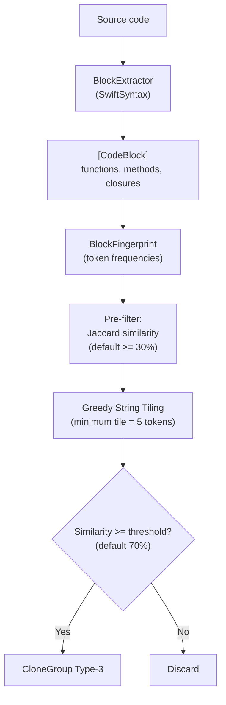

### Type-4: Semantic Clones

Functionally equivalent code with different implementations.

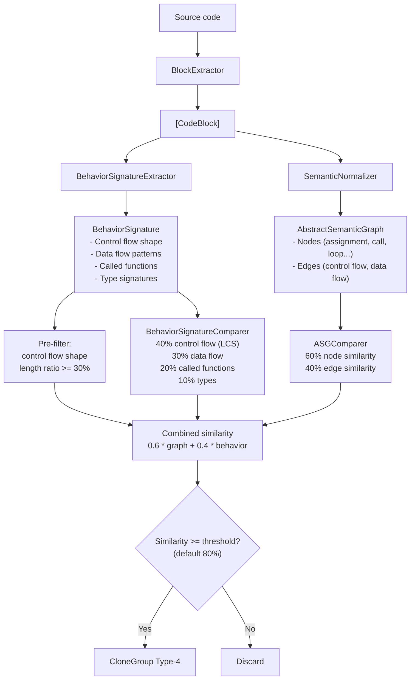

### Clone Type Comparison

| Type | Name | Detection Method | Example |
|------|------|------------------|---------|
| Type-1 | Exact | Rolling hash + exact match | Identical copy-pasted code |
| Type-2 | Parameterized | Rolling hash + normalized match | Same structure, different names |
| Type-3 | Gapped | Greedy String Tiling | Similar with insertions/deletions |
| Type-4 | Semantic | ASG + Behavioral Signatures | Different implementation, same logic |

---

## Reporting System

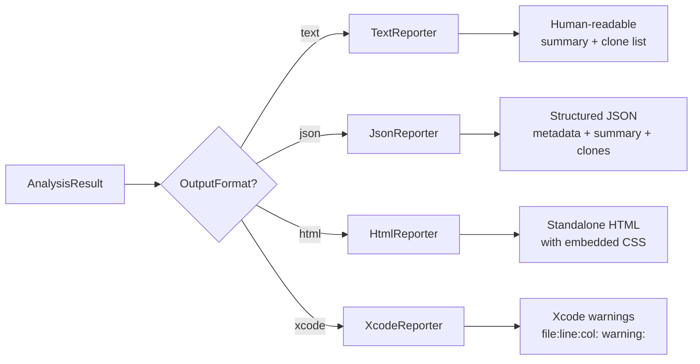

### Output Formats

**Text** (default): Human-readable summary with clone locations.

**JSON**: Machine-readable with metadata (configuration, execution time, timestamp), summary (counts by type, duplication percentage), and detailed clone information with code previews.

**HTML**: Standalone page with color-coded clone type badges (Type-1: green, Type-2: blue, Type-3: orange, Type-4: red).

**Xcode**: Warnings in `file:line:column: warning: message` format for Xcode build integration.

---

## Caching System

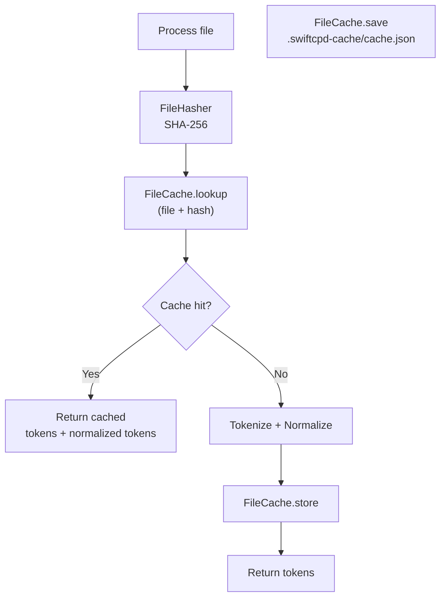

`FileCache` is an **actor** ensuring thread-safe access from parallel tokenization tasks. The cache persists to `.swiftcpd-cache/cache.json` and is keyed by file path + SHA-256 content hash.

---

## Baseline System

**`--baseline-generate`**

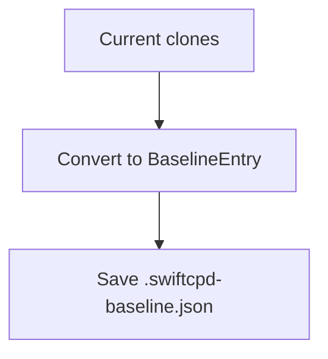

**`--baseline-update`**

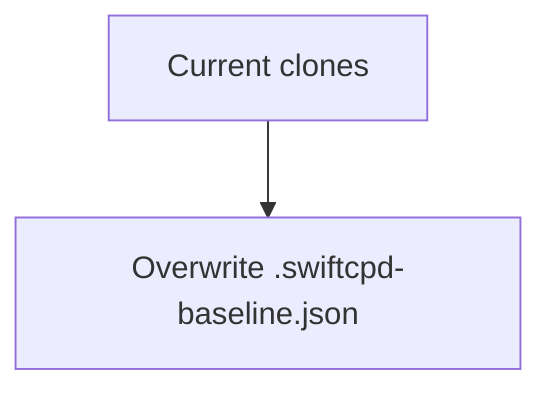

**`--baseline path`**

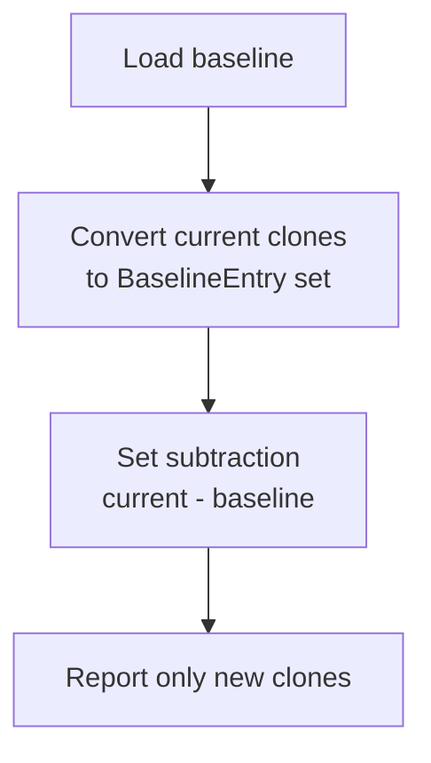

Each `BaselineEntry` contains the clone type, token count, line count, and fragment fingerprints (file + line range). Comparison uses set subtraction to identify clones not present in the baseline.

---

## Concurrency Model

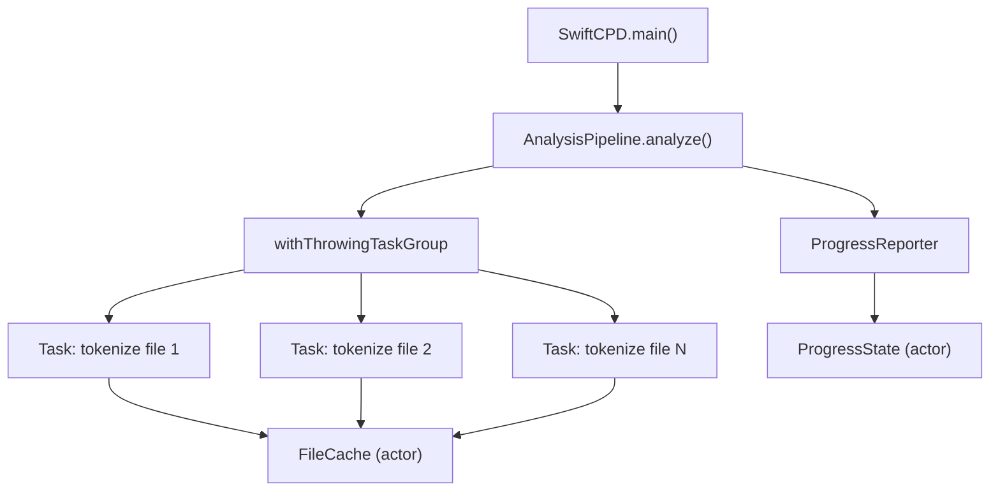

| Component | Pattern | Purpose |
|-----------|---------|---------|
| `FileCache` | Actor | Thread-safe tokenization cache |
| `ProgressState` | Actor | Manages cancellable progress task |
| `AnalysisPipeline` | TaskGroup | Parallel file tokenization |
| All data types | Sendable structs/enums | Safe cross-task data sharing |

---

## Configuration Flow

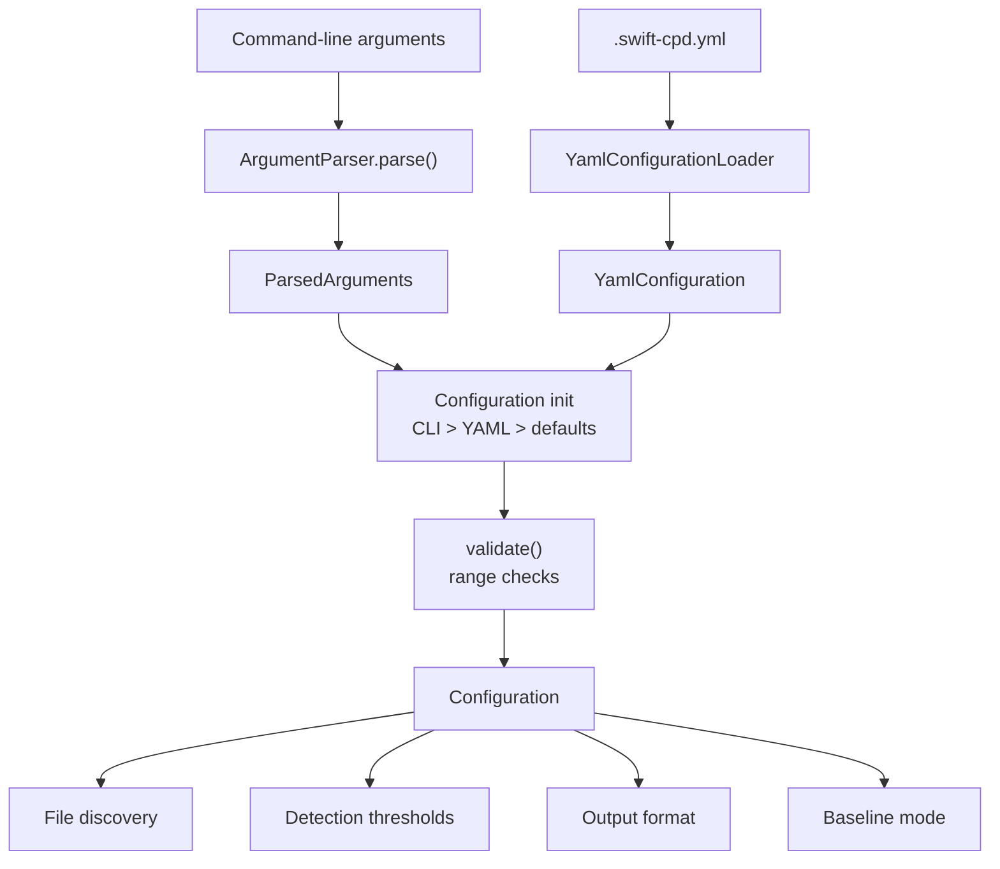

### Default Values

| Parameter | Default | Range |
|-----------|---------|-------|
| `--min-tokens` | 50 | 10 - 500 |
| `--min-lines` | 5 | 2 - 100 |
| `--format` | text | text, json, html, xcode |
| `--type3-similarity` | 70 | 50 - 100 |
| `--type3-tile-size` | 5 | 2 - 20 |
| `--type3-candidate-threshold` | 30 | 10 - 80 |
| `--type4-similarity` | 80 | 60 - 100 |
| `--suppression-tag` | `swiftcpd:ignore` | any string |
| `--types` | 1,2,3,4 | any subset |
| `--ignore-same-file` | `false` | boolean |
| `--ignore-structural` | `false` | boolean |

---

## Inline Suppression

The `SuppressionScanner` allows suppressing clone detection for specific code regions using comments.

```swift
// swiftcpd:ignore
func suppressedFunction() {
    // entire function body is suppressed
}
```

When the scanner finds the suppression tag, it suppresses the following content line. If that line contains `{`, the entire block until the matching `}` is suppressed.
