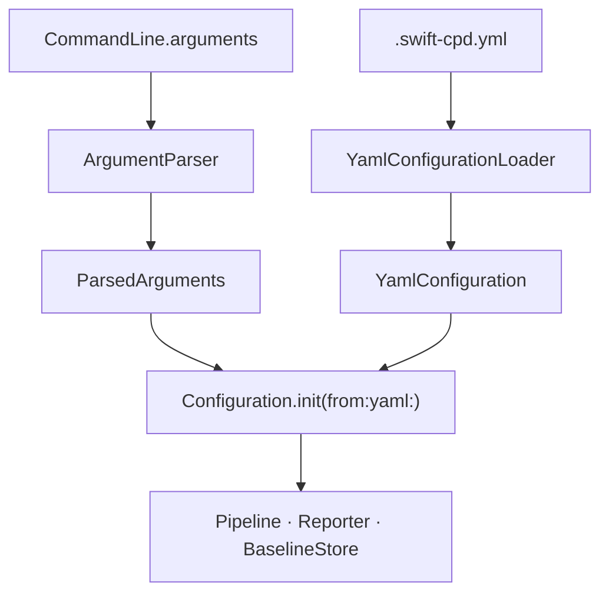

# CLI & Configuration

← [Index](README.md) | Next: [File Discovery →](02-file-discovery.md)

---

## Overview

The CLI layer parses command-line arguments and a YAML config file, then merges them into a single `Configuration` value that drives the rest of the tool.



---

## ArgumentParser

```swift
struct ArgumentParser: Sendable
```

Parses `CommandLine.arguments` into a `ParsedArguments` value. Throws `ArgumentParsingError` on unknown flags or invalid values.

```swift
func parse(_ arguments: [String]) throws -> ParsedArguments
```

All numeric arguments are parsed and range-validated here. Boolean flags default to `false`; value arguments default to `nil` (meaning "use YAML or built-in default").

### Supported flags

| Flag | Type | Description |
|---|---|---|
| `--min-tokens <N>` | `Int` | Minimum clone length in tokens |
| `--min-lines <N>` | `Int` | Minimum clone length in lines |
| `--format <fmt>` | `OutputFormat` | Output format |
| `--output <path>` | `String` | Write output to file |
| `--baseline-generate` | flag | Generate baseline |
| `--baseline-update` | flag | Update baseline |
| `--baseline <path>` | `String` | Baseline file path |
| `--config <path>` | `String` | YAML config file path |
| `--max-duplication <N>` | `Double` | Fail threshold (%) |
| `--type3-similarity <N>` | `Int` | Type 3 similarity (%) |
| `--type3-tile-size <N>` | `Int` | GST minimum tile size |
| `--type3-candidate-threshold <N>` | `Int` | Jaccard pre-filter (%) |
| `--type4-similarity <N>` | `Int` | Type 4 similarity (%) |
| `--types <list>` | `Set<CloneType>` | e.g. `1,2,3` or `all` |
| `--exclude <pattern>` | `[String]` | Glob pattern (repeatable) |
| `--suppression-tag <tag>` | `String` | Comment suppression tag |
| `--cross-language` | flag | Include C-family files |
| `--ignore-same-file` | flag | Skip same-file clones |
| `--ignore-structural` | flag | Skip Type 3/4 clones |
| `--cache-dir <path>` | `String` | Cache directory |
| `--version` | flag | Print version and exit |
| `--help` | flag | Print help and exit |
| `init` | command | Generate `.swift-cpd.yml` |

---

## ParsedArguments

```swift
struct ParsedArguments: Sendable, Equatable
```

A plain container for raw CLI values. Every optional field being `nil` means "not provided; defer to YAML or built-in default".

```swift
var paths: [String]
var minimumTokenCount: Int?
var minimumLineCount: Int?
var format: OutputFormat?
var outputFilePath: String?
var showVersion: Bool
var showHelp: Bool
var showInit: Bool
var baselineGenerate: Bool
var baselineUpdate: Bool
var baselineFilePath: String?
var configFilePath: String?
var maxDuplication: Double?
var type3Similarity: Int?
var type3TileSize: Int?
var type3CandidateThreshold: Int?
var type4Similarity: Int?
var crossLanguageEnabled: Bool
var ignoreSameFile: Bool
var ignoreStructural: Bool
var excludePatterns: [String]
var inlineSuppressionTag: String?
var enabledCloneTypes: Set<CloneType>?
var cacheDirectory: String?
```

---

## Configuration

```swift
struct Configuration: Sendable
```

The single source of truth for a run. Constructed by merging `ParsedArguments` and an optional `YamlConfiguration`. CLI values take precedence over YAML values, which take precedence over built-in defaults.

```swift
init(from parsed: ParsedArguments, yaml: YamlConfiguration? = nil) throws
```

Throws `ConfigurationError` when `paths` is empty after merging.

### Fields and defaults

| Field | Type | Default |
|---|---|---|
| `paths` | `[String]` | _(required)_ |
| `minimumTokenCount` | `Int` | `50` |
| `minimumLineCount` | `Int` | `5` |
| `outputFormat` | `OutputFormat` | `.text` |
| `outputFilePath` | `String?` | `nil` |
| `baselineMode` | `BaselineMode` | `.none` |
| `baselineFilePath` | `String` | `.swift-cpd-baseline.json` |
| `maxDuplication` | `Double?` | `nil` |
| `type3Similarity` | `Int` | `70` |
| `type3TileSize` | `Int` | `5` |
| `type3CandidateThreshold` | `Int` | `30` |
| `type4Similarity` | `Int` | `80` |
| `crossLanguageEnabled` | `Bool` | `false` |
| `excludePatterns` | `[String]` | `[]` |
| `inlineSuppressionTag` | `String` | `"swiftcpd:ignore"` |
| `enabledCloneTypes` | `Set<CloneType>` | all four types |
| `ignoreSameFile` | `Bool` | `true` |
| `ignoreStructural` | `Bool` | `true` |
| `cacheDirectory` | `String` | `.swift-cpd-cache` |

---

## Supporting Enums

### OutputFormat

```swift
enum OutputFormat: String, Sendable
```

| Case | Description |
|---|---|
| `.text` | Human-readable console output |
| `.json` | Structured JSON report |
| `.html` | Self-contained HTML page |
| `.xcode` | `file:line: warning:` format for Xcode integration |

### BaselineMode

```swift
enum BaselineMode: Sendable, Equatable
```

| Case | Triggered by | Behaviour |
|---|---|---|
| `.none` | _(default)_ | Report all clones |
| `.generate` | `--baseline-generate` | Save current clones as baseline, exit 0 |
| `.update` | `--baseline-update` | Overwrite baseline with current clones, exit 0 |
| `.compare` | Baseline file exists | Report only clones absent from baseline |

### ExitCode

```swift
enum ExitCode: Int32, Sendable
```

| Case | Value | Meaning |
|---|---|---|
| `.success` | `0` | No clones, or duplication below threshold |
| `.clonesDetected` | `1` | Clones found above threshold |
| `.configurationError` | `2` | Invalid arguments or YAML |
| `.analysisError` | `3` | Runtime error during analysis |

---

## SourcePathDiscovery

```swift
struct SourcePathDiscovery
```

Used by the `init` command to populate the `paths:` field of the generated `.swift-cpd.yml` automatically.

```swift
func discover(in rootPath: String = ".") -> [String]
```

**Resolution order:**

1. If `Sources/` exists at `rootPath` → returns `["Sources/"]` (SPM layout).
2. Scans top-level directories of `rootPath` for any that contain `.swift` files (recursive).
3. Excludes: `.build`, `.git`, `.swiftpm`, `DerivedData`, `Pods`, `Carthage`, `vendor`, `Packages`, `build`, `Build`.
4. Returns sorted list of discovered directories with trailing `/`.
5. If nothing found → falls back to `["Sources/"]`.

---

← [Index](README.md) | Next: [File Discovery →](02-file-discovery.md)
