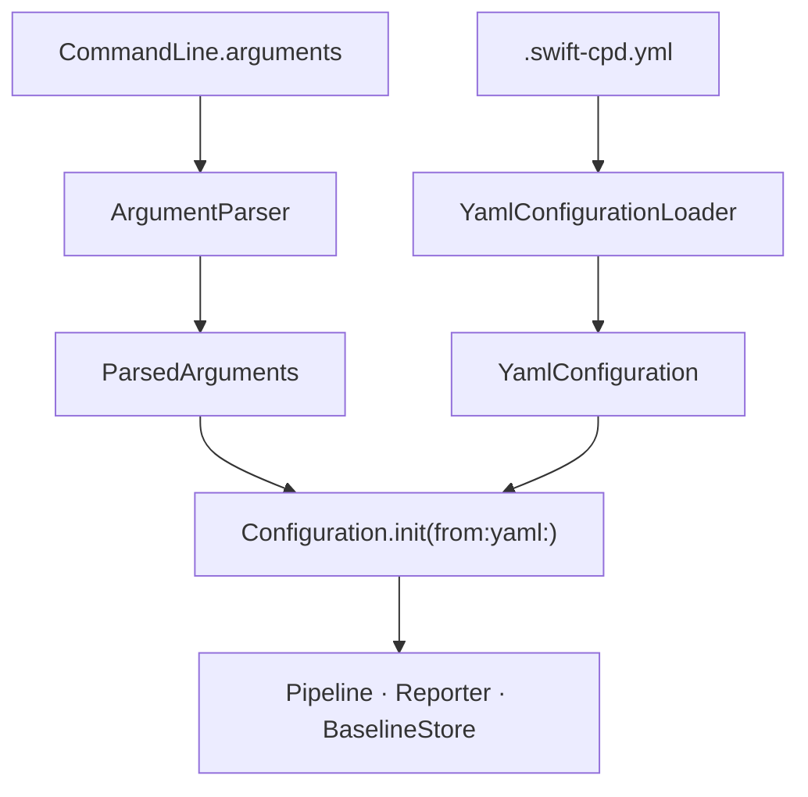

# CLI & Configuration

← [Index](README.md) | Next: [File Discovery →](02-file-discovery.md)

---

## Overview

The CLI layer parses command-line arguments and a YAML config file, then merges them into a single `Configuration` value that drives the rest of the tool.


```mermaid
flowchart TD
    argv["CommandLine.arguments"] --> AP["ArgumentParser"]
    AP --> PA["ParsedArguments"]
    yml[".swift-cpd.yml"] --> YL["YamlConfigurationLoader"]
    YL --> YC["YamlConfiguration"]
    PA --> CFG["Configuration.init(from:yaml:)"]
    YC --> CFG
    CFG --> rest["Pipeline · Reporter · BaselineStore"]
```

---

## ArgumentParser

```swift
struct ArgumentParser: Sendable
```

Parses `CommandLine.arguments` into a `ParsedArguments` value. Throws `ArgumentParsingError` on unknown flags or invalid values.

```swift
func parse(_ arguments: [String]) throws -> ParsedArguments
```

The first element (the executable name) is dropped. Every argument that does not start with `--` is a positional: the literal `init` sets `showInit`, anything else is appended to `paths`. Flags may appear in any order and value flags consume the next argument.

Numeric arguments are parsed here, but only `--max-duplication` is range-checked at this stage (`0...100`); the ranges of the other numeric options are validated later by `Configuration`. Boolean flags default to `false`; value arguments default to `nil` (meaning "use YAML or built-in default").

### Supported flags

| Flag | Type | Description |
|---|---|---|
| `--min-tokens <N>` | `Int` | Minimum clone length in tokens |
| `--min-lines <N>` | `Int` | Minimum clone length in lines |
| `--format <fmt>` | `OutputFormat` | Output format |
| `--output <path>` | `String` | Write output to file |
| `--baseline-generate` | flag | Generate baseline |
| `--baseline-update` | flag | Update baseline |
| `--baseline <path>` | `String` | Baseline file path |
| `--config <path>` | `String` | YAML config file path |
| `--max-duplication <N>` | `Double` | Fail threshold (%) |
| `--type3-similarity <N>` | `Int` | Type 3 similarity (%) |
| `--type3-tile-size <N>` | `Int` | GST minimum tile size |
| `--type3-candidate-threshold <N>` | `Int` | Jaccard pre-filter (%) |
| `--type4-similarity <N>` | `Int` | Type 4 similarity (%) |
| `--types <list>` | `Set<CloneType>` | e.g. `1,2,3` or `all` |
| `--exclude <pattern>` | `[String]` | Glob pattern (repeatable) |
| `--suppression-tag <tag>` | `String` | Comment suppression tag |
| `--cross-language` | flag | Include C-family files |
| `--ignore-same-file` | flag | Skip same-file clones |
| `--ignore-structural` | flag | Skip Type 3/4 clones |
| `--no-cache` | flag | Disable tokenization cache |
| `--cache-dir <path>` | `String` | Cache directory |
| `--source-ref <ref>` | `String` | Read sources from a git ref instead of the working tree |
| `--version` | flag | Print version and exit |
| `--help` | flag | Print help and exit |
| `init` | command | Generate `.swift-cpd.yml` |

`--types` accepts `all` or a comma-separated list of `1`–`4` (whitespace around items is trimmed). `--exclude` may be repeated; every pattern is appended to `excludePatterns`.

### ArgumentParsingError

```swift
enum ArgumentParsingError: Error, Sendable, Equatable
```

| Case | Message |
|---|---|
| `.unknownFlag(flag)` | `unknown flag '<flag>'` |
| `.missingValue(flag)` | `missing value for '<flag>'` |
| `.invalidIntegerValue(value, flag)` | `invalid integer value '<value>' for '<flag>'` |
| `.invalidFormatValue(value)` | `invalid format '<value>', expected: text, json, html, xcode` |
| `.invalidDuplicationValue(value)` | `invalid duplication value '<value>', expected a number between 0 and 100` |
| `.invalidTypesValue(value)` | `invalid types value '<value>', expected comma-separated list of: 1, 2, 3, 4` |

`SwiftCPD.main` prints parsing errors as `error: <message>` to stderr and exits with `.configurationError`.

---

## ParsedArguments

```swift
struct ParsedArguments: Sendable, Equatable
```

A plain container for raw CLI values. Every optional field being `nil` means "not provided; defer to YAML or built-in default".

```swift
var paths: [String]
var minimumTokenCount: Int?
var minimumLineCount: Int?
var format: OutputFormat?
var outputFilePath: String?
var showVersion: Bool
var showHelp: Bool
var showInit: Bool
var baselineGenerate: Bool
var baselineUpdate: Bool
var baselineFilePath: String?
var configFilePath: String?
var maxDuplication: Double?
var type3Similarity: Int?
var type3TileSize: Int?
var type3CandidateThreshold: Int?
var type4Similarity: Int?
var crossLanguageEnabled: Bool
var ignoreSameFile: Bool
var ignoreStructural: Bool
var excludePatterns: [String]
var inlineSuppressionTag: String?
var enabledCloneTypes: Set<CloneType>?
var cacheDirectory: String?
var noCache: Bool
var sourceRef: String?
```

---

## Configuration

```swift
struct Configuration: Sendable
```

The single source of truth for a run. Constructed by merging `ParsedArguments` and an optional `YamlConfiguration`. CLI values take precedence over YAML values, which take precedence over built-in defaults.

```swift
init(from parsed: ParsedArguments, yaml: YamlConfiguration? = nil) throws
```

Merge rules that differ from the plain `CLI ?? YAML ?? default` pattern:

| Field | Rule |
|---|---|
| `paths` | CLI paths if any were given, otherwise YAML `paths` |
| `excludePatterns` | CLI patterns followed by YAML `exclude` (concatenated) |
| `crossLanguageEnabled`, `ignoreSameFile`, `ignoreStructural`, `noCache` | `CLI flag || YAML value` — a CLI flag can only enable, never disable |
| `outputFormat` | YAML `outputFormat` strings that are not a valid `OutputFormat` are ignored (fall back to `.text`) |
| `enabledCloneTypes` | YAML integers that are not a valid `CloneType` are dropped |
| `sourceRef` | An empty string (from CLI or YAML) becomes `nil` |
| `maxDuplication` | The `0...100` check happens only in `ArgumentParser`; a YAML value is not range-checked |
| `outputFilePath`, `baselineFilePath`, `cacheDirectory`, `baselineMode` | CLI only; there is no YAML key |

### ConfigurationError

```swift
enum ConfigurationError: Error, Sendable, Equatable {
    case noPathsSpecified
    case parameterOutOfRange(name: String, value: Int, validRange: ClosedRange<Int>)
}
```

`noPathsSpecified` is thrown when `paths` is empty after merging. After merging, `validate()` checks the numeric ranges and throws `parameterOutOfRange` for the first value outside its range:

| Field | Valid range |
|---|---|
| `minimumTokenCount` | `10...500` |
| `minimumLineCount` | `2...100` |
| `type3Similarity` | `50...100` |
| `type3TileSize` | `2...20` |
| `type3CandidateThreshold` | `10...80` |
| `type4Similarity` | `60...100` |

`SwiftCPD.main` prints the error followed by the usage text and exits with `.configurationError`.

### Fields and defaults

| Field | Type | Default |
|---|---|---|
| `paths` | `[String]` | _(required)_ |
| `minimumTokenCount` | `Int` | `50` |
| `minimumLineCount` | `Int` | `5` |
| `outputFormat` | `OutputFormat` | `.text` |
| `outputFilePath` | `String?` | `nil` |
| `baselineMode` | `BaselineMode` | `.none` |
| `baselineFilePath` | `String` | `.swift-cpd-baseline.json` |
| `maxDuplication` | `Double?` | `nil` |
| `type3Similarity` | `Int` | `70` |
| `type3TileSize` | `Int` | `5` |
| `type3CandidateThreshold` | `Int` | `30` |
| `type4Similarity` | `Int` | `80` |
| `crossLanguageEnabled` | `Bool` | `false` |
| `excludePatterns` | `[String]` | `[]` |
| `inlineSuppressionTag` | `String` | `"swiftcpd:ignore"` |
| `enabledCloneTypes` | `Set<CloneType>` | all four types |
| `ignoreSameFile` | `Bool` | `false` |
| `ignoreStructural` | `Bool` | `false` |
| `noCache` | `Bool` | `false` |
| `cacheDirectory` | `String` | `.swift-cpd-cache` |
| `sourceRef` | `String?` | `nil` |

`baselineFilePath` always has a value, but it is only consulted when `baselineMode` is not `.none`. `cacheDirectory` is relative to the current working directory unless an absolute path is given.

When `sourceRef` is non-nil, `SwiftCPD.runAnalysis` resolves it via `GitRefResolver` and builds `GitRefSourceFileLister` + `GitRefSourceReader` instead of the filesystem variants. An empty string is treated as `nil` (reads the working tree). See the [Reading from a git ref](../USAGE.md#reading-from-a-git-ref---source-ref) section of USAGE for user-facing behavior.

---

## YAML Configuration

```swift
struct YamlConfiguration: Sendable, Equatable
struct YamlConfigurationLoader: Sendable
struct YamlConfigurationParser: Sendable
```

`SwiftCPD.loadYamlConfiguration` uses `YamlConfigurationLoader.load(from:)` when `--config <path>` is given (the file must exist) and `loadIfExists(from: ".swift-cpd.yml")` otherwise, which returns `nil` when the default file is absent. An empty or whitespace-only file yields a `YamlConfiguration` with every field `nil`.

`YamlConfiguration` mirrors the configurable settings; every field is optional:

| YAML key | Type | Maps to |
|---|---|---|
| `paths` | list of strings | `paths` |
| `minimumTokenCount` | `Int` | `minimumTokenCount` |
| `minimumLineCount` | `Int` | `minimumLineCount` |
| `outputFormat` | `String` | `outputFormat` |
| `maxDuplication` | `Double` | `maxDuplication` |
| `type3Similarity` | `Int` | `type3Similarity` |
| `type3TileSize` | `Int` | `type3TileSize` |
| `type3CandidateThreshold` | `Int` | `type3CandidateThreshold` |
| `type4Similarity` | `Int` | `type4Similarity` |
| `crossLanguageEnabled` | `Bool` | `crossLanguageEnabled` |
| `exclude` | list of strings | `excludePatterns` |
| `inlineSuppressionTag` | `String` | `inlineSuppressionTag` |
| `enabledCloneTypes` | list of `Int` | `enabledCloneTypes` |
| `ignoreSameFile` | `Bool` | `ignoreSameFile` |
| `ignoreStructural` | `Bool` | `ignoreStructural` |
| `noCache` | `Bool` | `noCache` |
| `sourceRef` | `String` | `sourceRef` |

`YamlConfigurationParser` is a minimal line-based parser, not a general YAML implementation:

- Each non-empty line is either `key: value`, `key:` (starts a block list), `key: []` (empty list) or `- item` (appends to the current list). Indentation is ignored.
- Inline lists other than `[]` and a `- item` without a preceding list key are rejected.
- A line starting with `#` is a comment, and everything from the first ` #` (space followed by `#`) on a line is stripped; matching single or double quotes around a value are removed.
- Booleans accept `true`/`false`/`yes`/`no` (case-insensitive). Integer, double and boolean keys with an unparseable value are rejected.
- Unknown keys are ignored.

`YamlConfigurationError` reports failures:

| Case | Message |
|---|---|
| `.fileNotReadable(path)` | `cannot read configuration file '<path>'` |
| `.invalidYaml(path)` | `invalid YAML in configuration file '<path>'` |

Both are printed by `SwiftCPD.main` as `error: <message>` and exit with `.configurationError`.

---

## Supporting Enums

### OutputFormat

```swift
enum OutputFormat: String, Sendable
```

| Case | Description |
|---|---|
| `.text` | Human-readable console output |
| `.json` | Structured JSON report |
| `.html` | Self-contained HTML page |
| `.xcode` | `file:line: warning:` format for Xcode integration |

### BaselineMode

```swift
enum BaselineMode: Sendable, Equatable
```

| Case | Triggered by | Behaviour |
|---|---|---|
| `.none` | _(default)_ | Report all clones |
| `.generate` | `--baseline-generate` | Save current clones to `baselineFilePath`, exit 0 |
| `.update` | `--baseline-update` | Overwrite `baselineFilePath` with current clones (no merge), exit 0 |
| `.compare` | `--baseline <path>` without generate/update | Report only clones absent from the baseline; a missing file counts as an empty baseline |

`resolveBaselineMode` checks the flags in order: `--baseline-generate` wins over `--baseline-update`, which wins over `--baseline <path>`.

### ExitCode

```swift
enum ExitCode: Int32, Sendable
```

| Case | Value | Meaning |
|---|---|---|
| `.success` | `0` | No clones; duplication at or below `maxDuplication` when set; always for `--format xcode` outside baseline comparison; baseline generate/update; `init`, `--help`, `--version` |
| `.clonesDetected` | `1` | Clones found (new clones in `.compare` mode); with `maxDuplication`, only when the percentage exceeds it |
| `.configurationError` | `2` | Invalid arguments, out-of-range values, unreadable or invalid YAML, no paths, no source files found, `init` when `.swift-cpd.yml` exists |
| `.analysisError` | `3` | Any error thrown during analysis (missing path, git ref errors, baseline I/O, tokenization), or `init` failing to write the file |

---

## SourcePathDiscovery

```swift
struct SourcePathDiscovery
```

Used by the `init` command to populate the `paths:` field of the generated `.swift-cpd.yml` automatically. `SwiftCPD.handleInit` refuses to overwrite an existing `.swift-cpd.yml` (exit `2`) and otherwise writes a template with the discovered `paths`, `minimumTokenCount: 50`, `minimumLineCount: 5`, `outputFormat: text`, `type3Similarity: 70`, `type4Similarity: 80`, `exclude: []`, `ignoreSameFile: true`, `ignoreStructural: true`, `enabledCloneTypes` 1–4 and a commented-out `# noCache: true`.

```swift
func discover(in rootPath: String = ".") -> [String]
```

**Resolution order:**

1. If `Sources/` exists at `rootPath` → returns `["Sources/"]` (SPM layout).
2. Scans top-level directories of `rootPath` for any that contain `.swift` files (recursive).
3. Skips names starting with `.` and the excluded set: `.build`, `.git`, `.swiftpm`, `.Trash`, `build`, `Build`, `DerivedData`, `Pods`, `Carthage`, `vendor`, `Packages`.
4. Returns sorted list of discovered directories with trailing `/`.
5. If nothing found → falls back to `["Sources/"]`.

---

← [Index](README.md) | Next: [File Discovery →](02-file-discovery.md)
