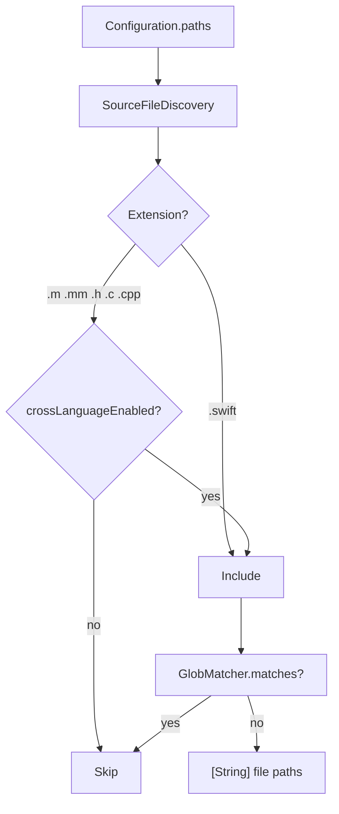

# File Discovery

← [CLI & Configuration](01-cli-configuration.md) | Next: [Tokenization →](03-tokenization.md)

---

## Overview

`SourceFileDiscovery` walks one or more directory trees and returns the list of source file paths that should be analyzed. It is the first step of `SwiftCPD.runAnalysis`.



---

## SourceFileDiscovery

```swift
struct SourceFileDiscovery: Sendable
```

### Initializer

```swift
init(crossLanguageEnabled: Bool, excludePatterns: [String] = [])
```

### Method

```swift
func findSourceFiles(in paths: [String]) throws -> [String]
```

Throws `FileDiscoveryError.pathDoesNotExist(String)` if any path in `paths` does not exist on disk.

### Rules

- **Included extensions:** `.swift` always; `.m`, `.mm`, `.h`, `.c`, `.cpp` when `crossLanguageEnabled` is `true`.
- **Always-excluded directories** (skipped during enumeration):
  - `.build` · `.git` · `DerivedData` · `Pods` · `Carthage` · `SourcePackages`
- **Pattern exclusions:** files whose path matches any entry in `excludePatterns` via `GlobMatcher`.
- **Symlinks:** never followed.
- The returned array is sorted for deterministic processing order.

---

## GlobMatcher

```swift
struct GlobMatcher: Sendable
```

Matches file paths against a list of glob patterns. Used to implement the `--exclude` option.

```swift
init(patterns: [String])
func matches(_ filePath: String) -> Bool
```

Patterns support `*` (any characters within a path component) and `**` (any number of path components). A file is excluded if it matches **any** pattern in the list.

### CompiledPattern

An internal type that pre-compiles a glob string into a `NSRegularExpression` for efficient repeated matching. Not part of the public API.

---

## FileDiscoveryError

```swift
enum FileDiscoveryError: Error, Sendable
```

| Case | Meaning |
|---|---|
| `.pathDoesNotExist(String)` | A path passed to `findSourceFiles(in:)` does not exist |

---

← [CLI & Configuration](01-cli-configuration.md) | Next: [Tokenization →](03-tokenization.md)
