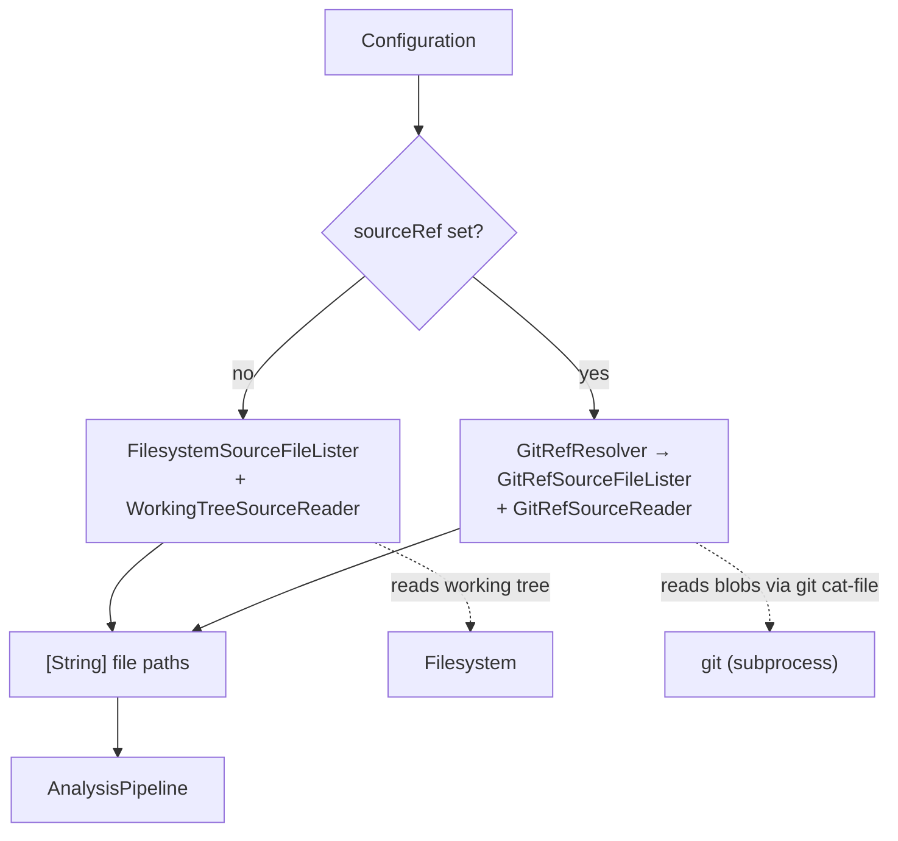
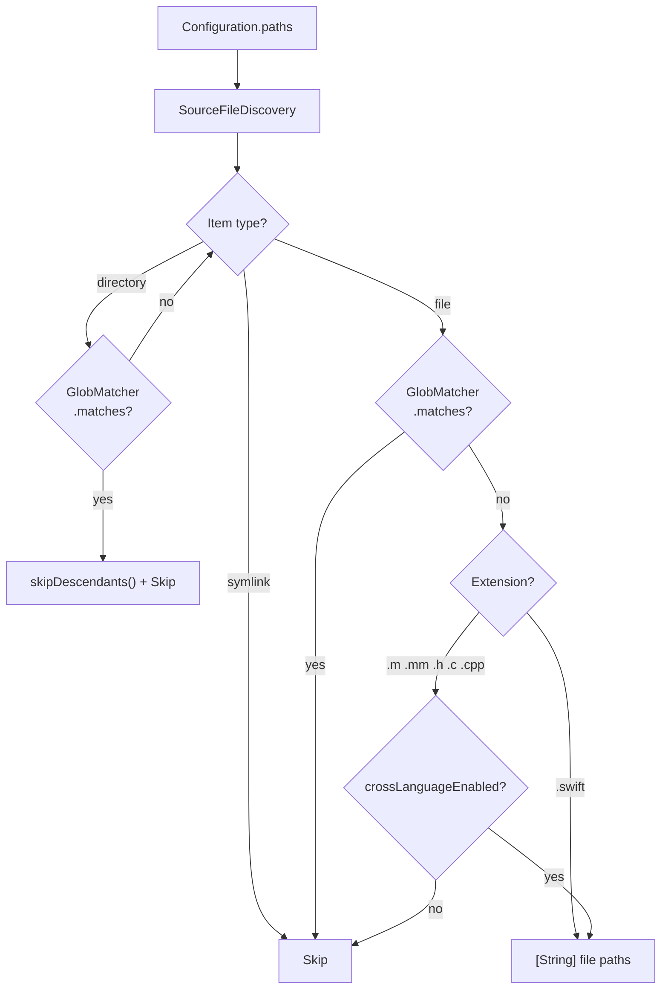

# File Discovery & Source IO

← [CLI & Configuration](01-cli-configuration.md) | Next: [Tokenization →](03-tokenization.md)

---

## Overview

Source files reach the analysis pipeline through two cooperating abstractions:

- **`SourceFileLister`** — lists the paths to analyze under the configured `paths:` entries.
- **`SourceReader`** — reads the raw bytes of a single file.

Each has two implementations, paired by mode:

| Mode | Lister | Reader |
|---|---|---|
| Working tree (default) | `FilesystemSourceFileLister` (wraps `SourceFileDiscovery`) | `WorkingTreeSourceReader` |
| Git ref (`--source-ref`) | `GitRefSourceFileLister` | `GitRefSourceReader` |

`SwiftCPD.runAnalysis` picks the pair from `Configuration.sourceRef` and feeds the listed files to `AnalysisPipeline` together with the reader. The pipeline never touches the filesystem directly.


```mermaid
flowchart TD
    cfg[Configuration] --> sel{sourceRef set?}
    sel -- no --> FS["FilesystemSourceFileLister<br/>+ WorkingTreeSourceReader"]
    sel -- yes --> GR["GitRefResolver →<br/>GitRefSourceFileLister<br/>+ GitRefSourceReader"]
    FS --> files["[String] file paths"]
    GR --> files
    files --> PIPE[AnalysisPipeline]
    FS -.reads working tree.-> WT[Filesystem]
    GR -.reads blobs via git cat-file.-> GIT["git (subprocess)"]
```

---

## Protocols

### SourceFileLister

```swift
protocol SourceFileLister: Sendable
func listFiles(in paths: [String]) throws -> [String]
```

Returns absolute paths sorted deterministically.

### SourceReader

```swift
protocol SourceReader: Sendable
func read(file: String) throws -> Data
```

Returns raw bytes. The reader does not assume UTF-8; the pipeline decodes when needed.

---

## Working-tree implementations

### FilesystemSourceFileLister

```swift
struct FilesystemSourceFileLister: SourceFileLister
init(crossLanguageEnabled: Bool, excludePatterns: [String] = [])
```

Thin wrapper around `SourceFileDiscovery` so the pipeline depends on the `SourceFileLister` protocol instead of a concrete struct.

### WorkingTreeSourceReader

```swift
struct WorkingTreeSourceReader: SourceReader
```

Reads file content via `Data(contentsOf: URL(fileURLWithPath:))`. No state.

---

## Git-ref implementations

When `Configuration.sourceRef` is set, the IO module shells out to `git` instead of the filesystem. See [Source IO (Git Refs)](12-source-io.md) for the full reference; this section is a summary.

```swift
struct GitRefSourceFileLister: SourceFileLister
init(
    ref: String,
    resolvedSha: String,
    repositoryRoot: String,
    crossLanguageEnabled: Bool,
    excludePatterns: [String] = [],
    runner: GitProcessRunner = .init(),
    stderr: @escaping @Sendable (String) -> Void = { ... }
)
```

- For named refs/shas: runs `git ls-tree -r <resolvedSha> -- <paths>`.
- For `:0` (the index): runs `git ls-files --stage -- <paths>`.
- Skips submodule entries (mode `160000`) with a warning to stderr.

```swift
struct GitRefSourceReader: SourceReader
init(ref: String, resolvedSha: String, repositoryRoot: String, runner: GitProcessRunner = .init())
```

- Reads via `git cat-file blob <resolvedSha>:<repo-relative-path>` (or `:0:<path>` when the ref is the index).

Both git implementations share a path-normalization helper, `repositoryRelativePath(for:in:)`, that throws `FileDiscoveryError.pathOutsideRepository` when a path escapes the repo root.

---

## SourceFileDiscovery


```mermaid
flowchart TD
    paths["Configuration.paths"] --> SFD["SourceFileDiscovery"]
    SFD --> item{Item type?}
    item -- symlink --> skip[Skip]
    item -- directory --> excl{"GlobMatcher\n.matches?"}
    excl -- yes --> prune["skipDescendants() + Skip"]
    excl -- no --> item
    item -- file --> excl2{"GlobMatcher\n.matches?"}
    excl2 -- yes --> skip
    excl2 -- no --> ext{Extension?}
    ext -- .swift --> result["[String] file paths"]
    ext -- ".m .mm .h .c .cpp" --> CL{crossLanguageEnabled?}
    CL -- yes --> result
    CL -- no --> skip
```

```swift
struct SourceFileDiscovery: Sendable
```

### Initializer

```swift
init(crossLanguageEnabled: Bool, excludePatterns: [String] = [])
```

### Method

```swift
func findSourceFiles(in paths: [String]) throws -> [String]
```

Throws `FileDiscoveryError.pathDoesNotExist(String)` if any path in `paths` does not exist on disk.

### Rules

- **Included extensions:** `.swift` always; `.m`, `.mm`, `.h`, `.c`, `.cpp` when `crossLanguageEnabled` is `true`.
- **Always-excluded directories** (skipped during enumeration):
  - `.build` · `.git` · `DerivedData` · `Pods` · `Carthage` · `SourcePackages`
- **Pattern exclusions:** files whose path matches any entry in `excludePatterns` via `GlobMatcher`.
- **Symlinks:** never followed.
- The returned array is sorted for deterministic processing order.

---

## GlobMatcher

```swift
struct GlobMatcher: Sendable
```

Matches file paths against a list of glob patterns. Used to implement the `--exclude` option.

```swift
init(patterns: [String])
func matches(_ filePath: String) -> Bool
```

Patterns support `*` (any characters within a path component) and `**` (any number of path components). A file is excluded if it matches **any** pattern in the list.

### Matching semantics

- **Absolute patterns** (starting with `/`): matched against the full absolute path anchored at the start.
- **Relative patterns** (not starting with `/`): matched at path-component boundaries anywhere in the absolute path. `Sources/Foo/Bar` matches `/Users/project/Sources/Foo/Bar/File.swift`.
- **Directory patterns** (ending with `/`): match the directory itself and all files within it. `Sources/Generated/` matches both the directory URL and any file inside it, enabling early pruning via `enumerator.skipDescendants()`.

### CompiledPattern

An internal type that pre-compiles a glob string into a `NSRegularExpression` for efficient repeated matching. Not part of the public API.

---

## FileDiscoveryError

```swift
enum FileDiscoveryError: Error, Sendable
```

| Case | Meaning |
|---|---|
| `.pathDoesNotExist(String)` | A path passed to `findSourceFiles(in:)` does not exist on the filesystem |
| `.pathDoesNotExistInRef(path:, ref:)` | A path has no matches in the listed ref's tree (git mode) |
| `.pathOutsideRepository(path:, repositoryRoot:)` | A path resolves outside the repository root (git mode) |

---

← [CLI & Configuration](01-cli-configuration.md) | Next: [Tokenization →](03-tokenization.md)
