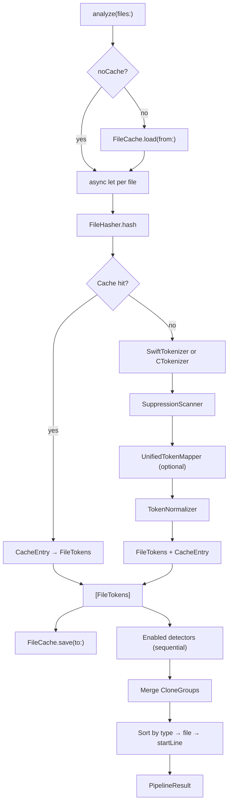

# Pipeline

← [Tokenization](03-tokenization.md) | Next: [Detection — Core →](05-detection-core.md)

---

## AnalysisPipeline

```swift
struct AnalysisPipeline: Sendable
```

Orchestrates file loading, tokenization, and detection. The entry point for every analysis run.

### Initializer

```swift
init(
    minimumTokenCount: Int = 50,
    minimumLineCount: Int = 5,
    cacheDirectory: String = ".swift-cpd-cache",
    noCache: Bool = false,
    crossLanguageEnabled: Bool = false,
    thresholds: DetectionThresholds = .defaults,
    inlineSuppressionTag: String = "swiftcpd:ignore",
    enabledCloneTypes: Set<CloneType> = Set(CloneType.allCases)
)
```

### Method

```swift
func analyze(files: [String]) async throws -> PipelineResult
```

The method is `async` because file loading is parallelized with Swift concurrency. Individual file tokenization tasks run concurrently; detection runs sequentially after all `FileTokens` are collected.

### Execution sequence



### Detector selection

Only detectors whose `supportedCloneTypes` intersects with `enabledCloneTypes` are instantiated and run:

| Enabled types | Detectors run |
|---|---|
| `{1}` or `{2}` or `{1,2}` | `CloneDetector` |
| `{3}` | `Type3Detector` |
| `{4}` | `Type4Detector` |

---

## DetectionThresholds

```swift
struct DetectionThresholds: Sendable
```

Bundles all numeric thresholds for Type 3 and Type 4 detectors. Passed as a unit to `AnalysisPipeline`.

```swift
static let defaults: DetectionThresholds  // type3: 70%, tile: 5, candidate: 30%; type4: 80%

let type3Similarity: Int          // 50–100, default 70
let type3TileSize: Int            // 2–20, default 5
let type3CandidateThreshold: Int  // 10–80, default 30
let type4Similarity: Int          // 60–100, default 80
```

---

## PipelineResult

```swift
struct PipelineResult: Sendable, Equatable
```

The value returned by `AnalysisPipeline.analyze(files:)`.

```swift
let cloneGroups: [CloneGroup]
let totalTokens: Int
```

`totalTokens` is the sum of all tokens across all files (before suppression). Used by `DuplicationCalculator` to compute the duplication percentage.

---

## ProgressReporter

```swift
struct ProgressReporter: Sendable
```

Writes a progress message to a configurable `FileHandle` (default `.standardError`) after a configurable delay if the analysis is still running. Designed for text-format runs only.

```swift
init(totalFiles: Int, delayNanoseconds: UInt64 = 5_000_000_000, output: FileHandle = .standardError)
func start() async   // schedules the progress message after the delay
func stop() async    // cancels the scheduled message
func drain() async   // awaits the scheduled task to completion
```

`start()` is `async` because it directly `await`s the `ProgressState` actor to store the scheduled `Task`, eliminating any window between task creation and storage.

`drain()` waits for the task to finish naturally. Call it when cancellation is not desired but the caller must ensure the task has completed before proceeding.

### ProgressState

```swift
actor ProgressState
```

Internal actor that owns the cancellable `Task`. Serializes access to it.

```swift
func storeTask(_ task: Task<Void, Never>)
func cancelTask()
func awaitTask() async
```

---

← [Tokenization](03-tokenization.md) | Next: [Detection — Core →](05-detection-core.md)
