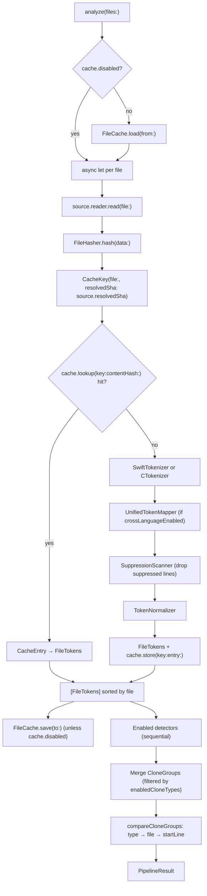

# Pipeline

← [Tokenization](03-tokenization.md) | Next: [Detection — Core →](05-detection-core.md)

---

## AnalysisPipeline

```swift
struct AnalysisPipeline: Sendable
```

Orchestrates file loading, tokenization, and detection. The entry point for every analysis run.

### Initializer

```swift
init(
    detection: DetectionOptions = DetectionOptions(),
    cache: CacheOptions = CacheOptions(directory: ".swift-cpd-cache"),
    source: SourceOptions = SourceOptions()
)
```

All initialization parameters are grouped into three nested value types — each lives in its own file (`AnalysisPipeline+DetectionOptions.swift`, `AnalysisPipeline+CacheOptions.swift`, `AnalysisPipeline+SourceOptions.swift`). Defaults preserve the working-tree, no-source-ref behavior. The initializer also builds the `SuppressionScanner` from `detection.inlineSuppressionTag`.

```swift
struct AnalysisPipeline.DetectionOptions: Sendable
var minimumTokenCount: Int = 50
var minimumLineCount: Int = 5
var thresholds: DetectionThresholds = .defaults
var enabledCloneTypes: Set<CloneType> = Set(CloneType.allCases)
var crossLanguageEnabled: Bool = false
var inlineSuppressionTag: String = "swiftcpd:ignore"
```

```swift
struct AnalysisPipeline.CacheOptions: Sendable
var directory: String              // required, no default
var disabled: Bool = false         // set true to bypass cache entirely
```

```swift
struct AnalysisPipeline.SourceOptions: Sendable
init(reader: any SourceReader = WorkingTreeSourceReader(), resolvedSha: String? = nil)
var reader: any SourceReader
var resolvedSha: String?           // when non-nil, namespaces cache entries by this sha
```

`tokenizeFile` always builds the cache key as `CacheKey(file: filePath, resolvedSha: source.resolvedSha)` and looks it up with `FileCache.lookup(key:contentHash:)`; when `resolvedSha` is non-nil the key is namespaced by that sha, so runs against different refs do not collide. See [Cache & Baseline](10-cache-baseline.md) for the on-disk envelope.

### Method

```swift
func analyze(files: [String]) async throws -> PipelineResult
```

The method is `async` because file loading is parallelized with Swift concurrency. Each file is tokenized in its own child task of a `withThrowingTaskGroup`; the resulting `[FileTokens]` is sorted by file path. Detection runs sequentially after all `FileTokens` are collected. Files whose extension is `.swift` go through `SwiftTokenizer`; every other file goes through `CTokenizer`. A file that is not valid UTF-8 throws `CocoaError(.fileReadInapplicableStringEncoding)`.

```swift
static func compareCloneGroups(_ lhs: CloneGroup, _ rhs: CloneGroup) -> Bool
```

Sort predicate for the final result: by clone type raw value, then by the first fragment's file, then by its `startLine`. Returns `false` if either group has no fragments.

### Execution sequence


```mermaid
flowchart TD
    A["analyze(files:)"] --> NCC{cache.disabled?}
    NCC -- no --> B["FileCache.load(from:)"]
    NCC -- yes --> C
    B --> C["async let per file"]
    C --> SR["source.reader.read(file:)"]
    SR --> D["FileHasher.hash(data:)"]
    D --> KEY["CacheKey(file:, resolvedSha: source.resolvedSha)"]
    KEY --> E{"cache.lookup(key:contentHash:) hit?"}
    E -- yes --> F["CacheEntry → FileTokens"]
    E -- no --> G["SwiftTokenizer or CTokenizer"]
    G --> I["UnifiedTokenMapper (if crossLanguageEnabled)"]
    I --> H["SuppressionScanner (drop suppressed lines)"]
    H --> J["TokenNormalizer"]
    J --> K["FileTokens + cache.store(key:entry:)"]
    F --> L["[FileTokens] sorted by file"]
    K --> L
    L --> M["FileCache.save(to:) (unless cache.disabled)"]
    L --> N["Enabled detectors (sequential)"]
    N --> O["Merge CloneGroups (filtered by enabledCloneTypes)"]
    O --> P["compareCloneGroups: type → file → startLine"]
    P --> Q["PipelineResult"]
```

### Detector selection

All three detectors are constructed, then only those whose `supportedCloneTypes` intersects with `enabledCloneTypes` are run. Each detector's output is filtered again so only groups whose `type` is in `enabledCloneTypes` are kept (e.g. enabling only `{1}` drops the Type 2 groups `CloneDetector` also produces):

| Enabled type | Detector run |
|---|---|
| `1` or `2` | `CloneDetector` |
| `3` | `Type3Detector` |
| `4` | `Type4Detector` |

When several types are enabled, every matching detector runs (e.g. `{1,3}` runs `CloneDetector` and `Type3Detector`).

---

## DetectionThresholds

```swift
struct DetectionThresholds: Sendable
```

Bundles all numeric thresholds for Type 3 and Type 4 detectors. Passed as a unit to `AnalysisPipeline` via `DetectionOptions.thresholds`. The ranges below are enforced by `Configuration` validation, not by this struct.

```swift
static let defaults: DetectionThresholds  // type3: 70%, tile: 5, candidate: 30%; type4: 80%

let type3Similarity: Int          // 50–100, default 70
let type3TileSize: Int            // 2–20, default 5
let type3CandidateThreshold: Int  // 10–80, default 30
let type4Similarity: Int          // 60–100, default 80
```

---

## PipelineResult

```swift
struct PipelineResult: Sendable, Equatable
```

The value returned by `AnalysisPipeline.analyze(files:)`.

```swift
let cloneGroups: [CloneGroup]
let totalTokens: Int
```

`totalTokens` is the sum of `FileTokens.tokens.count` across all files, i.e. counted after suppressed lines have been removed. Used by `DuplicationCalculator` to compute the duplication percentage.

---

## ProgressReporter

```swift
struct ProgressReporter: Sendable
```

Writes the message `Analyzing <totalFiles> files...` to a configurable `FileHandle` (default `.standardError`) after a configurable delay if the analysis is still running. `SwiftCPD` starts it only when the output format is `text`.

```swift
init(totalFiles: Int, delayNanoseconds: UInt64 = 5_000_000_000, output: FileHandle = .standardError)

let totalFiles: Int
let delayNanoseconds: UInt64

@discardableResult
func start() async -> Task<Void, Never>   // schedules the progress message after the delay
func stop() async                         // cancels the scheduled message
func writeProgress(_ message: String)     // writes message + "\n" to output
```

`start()` is `async` because it directly `await`s the `ProgressState` actor to store the scheduled `Task`, eliminating any window between task creation and storage. It also returns that `Task` so callers (e.g. tests) can await it.

### ProgressState

```swift
actor ProgressState
```

Internal actor that owns the cancellable `Task`. Serializes access to it.

```swift
func storeTask(_ task: Task<Void, Never>)
func cancelTask()   // cancels the stored task and clears it
```

---

← [Tokenization](03-tokenization.md) | Next: [Detection — Core →](05-detection-core.md)
