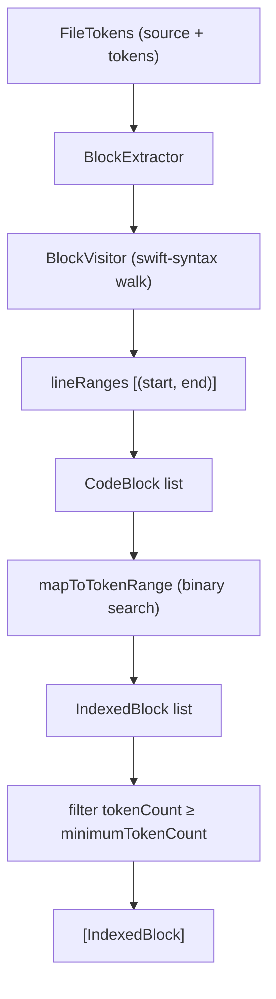

# Detection — Core Types

← [Pipeline](04-pipeline.md) | Next: [Detection — Type 1 & 2 →](06-detection-type12.md)

---

## Protocol

### DetectionAlgorithm

```swift
protocol DetectionAlgorithm: Sendable
```

The single abstraction that all three detectors conform to.

```swift
var supportedCloneTypes: Set<CloneType> { get }
func detect(files: [FileTokens]) -> [CloneGroup]
```

`detect` is a pure synchronous function. All detectors are value types (`struct`), so they require no synchronization and can be composed or swapped freely.

---

## Clone Types

### CloneType

```swift
enum CloneType: Int, Sendable, Equatable, Hashable, CaseIterable
```

| Case | Value | Description |
|---|---|---|
| `.type1` | `1` | Exact copy (after normalization) |
| `.type2` | `2` | Parameterized — same structure, different names/literals |
| `.type3` | `3` | Near-miss — additions, deletions, or rearrangement |
| `.type4` | `4` | Semantic — different implementation, same behavior |

The `rawValue` is the integer used in YAML configuration (`enabledCloneTypes: [1, 2, 3, 4]`).

---

## Result Types

### CloneGroup

```swift
struct CloneGroup: Sendable, Equatable, Hashable
```

One detected clone pair and its metadata.

```swift
let type:        CloneType
let tokenCount:  Int
let lineCount:   Int
let similarity:  Double    // always 100.0 for Type 1/2; percentage for Type 3/4
let fragments:   [CloneFragment]  // exactly two entries

var isStructural: Bool { type == .type3 || type == .type4 }
var isSameFile:   Bool  // true if both fragments are in the same file
```

`CloneGroup` also has a failable initializer used by Type 3 and Type 4 detectors to apply the `minimumLineCount` filter during construction:

```swift
init?(
    type: CloneType,
    pair: IndexedBlockPair,
    files: [FileTokens],
    similarity: Double,
    minimumLineCount: Int
)
```

### CloneFragment

```swift
struct CloneFragment: Sendable, Equatable, Hashable
```

Source location of one side of a clone.

```swift
let file:        String
let startLine:   Int
let endLine:     Int
let startColumn: Int
let endColumn:   Int
```

Two convenience initializers (in an `extension`, to preserve the memberwise initializer):

```swift
// From raw token indices
init(file: String, tokens: [Token], startIndex: Int, endIndex: Int)

// From an IndexedBlock
init(_ indexed: IndexedBlock, files: [FileTokens])
```

---

## Block Extraction

Block-based detectors (Type 3, Type 4) operate on syntactic blocks rather than raw token streams. The following types form the extraction pipeline.



### BlockExtraction

```swift
enum BlockExtraction
static func extractValidBlocks(files: [FileTokens], minimumTokenCount: Int) -> [IndexedBlock]
```

Namespace that coordinates `BlockExtractor` across all files.

### BlockExtractor

```swift
struct BlockExtractor: Sendable
func extract(source: String, file: String, tokens: [Token]) -> [CodeBlock]
```

Parses `source` with swift-syntax, runs `BlockVisitor` to get block line ranges, then maps each range to token indices using binary search (`O(log n)` per block).

### BlockVisitor

```swift
final class BlockVisitor: SyntaxVisitor
```

A swift-syntax `SyntaxVisitor` that records the line ranges of all extractable block constructs:

- `FunctionDeclSyntax` — free functions and methods
- `InitializerDeclSyntax` — `init` bodies
- `AccessorDeclSyntax` — `get`, `set`, `willSet`, `didSet`
- `ClosureExprSyntax` — closures

```swift
var lineRanges: [(startLine: Int, endLine: Int)]
```

### RangedSyntaxVisitor

```swift
class RangedSyntaxVisitor: SyntaxVisitor
```

Base class for `BehaviorSignatureExtractor` and `SemanticNormalizer`. Parses `source` at construction time and provides range-gating helpers.

```swift
init(source: String, file: String, startLine: Int, endLine: Int)

let sourceFile:  SourceFileSyntax
let converter:   SourceLocationConverter
let startLine:   Int
let endLine:     Int

func run()                                       // calls walk on sourceFile
func isInRange(_ node: some SyntaxProtocol) -> Bool
```

`isInRange` checks that the node's start line falls within `[startLine, endLine]`. Visitor overrides call this before processing any node.

### CodeBlock

```swift
struct CodeBlock: Sendable, Equatable
let file:            String
let startLine:       Int
let endLine:         Int
let startTokenIndex: Int
let endTokenIndex:   Int
```

### IndexedBlock

```swift
struct IndexedBlock: Sendable
let block:     CodeBlock
let fileIndex: Int   // index into the [FileTokens] array
```

### IndexedBlockPair

```swift
struct IndexedBlockPair: Sendable
let blockA: IndexedBlock
let blockB: IndexedBlock
```

Used to construct `CloneGroup` from a matched pair in Type 3 and Type 4 detectors.

---

## CloneGroupDeduplicator

```swift
enum CloneGroupDeduplicator
static func deduplicate(_ clones: [CloneGroup]) -> [CloneGroup]
```

Removes clones that are entirely covered by another clone in the same list. Two groups are considered duplicates when both their fragments are subsumed (same file, and the token range of one pair is a subset of the other). Used by `Type3Detector` and `Type4Detector` after scoring.

---

← [Pipeline](04-pipeline.md) | Next: [Detection — Type 1 & 2 →](06-detection-type12.md)
