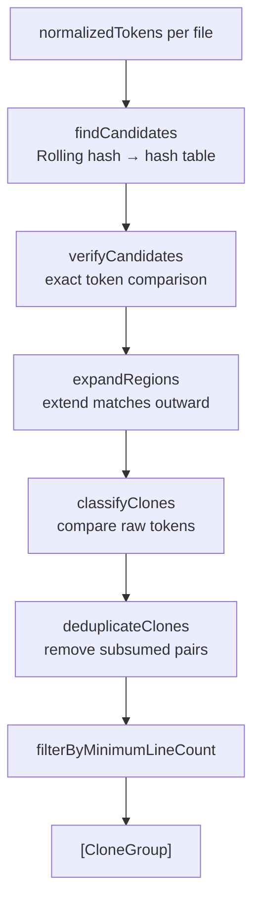

# Detection — Type 1 & 2

← [Detection Core](05-detection-core.md) | Next: [Detection — Type 3 →](07-detection-type3.md)

---

## CloneDetector

```swift
struct CloneDetector: DetectionAlgorithm
```

Detects exact (Type 1) and parameterized (Type 2) clones in a single pass over **normalized** tokens. Classification is deferred to the end, where raw tokens are compared to distinguish the two types.

```swift
init(minimumTokenCount: Int = 50, minimumLineCount: Int = 5)

var supportedCloneTypes: Set<CloneType> { [.type1, .type2] }

func detect(files: [FileTokens]) -> [CloneGroup]
```

### Internal pipeline



### findCandidates

Computes a rolling hash over a sliding window of `minimumTokenCount` normalized tokens for every position in every file. Positions that produce the same hash are grouped into a hash table. Entries with only one position are discarded (no match possible).

Returns `[UInt64: [TokenLocation]]`.

### verifyCandidates

For each hash-bucket with 2+ entries, compares all pairs of `TokenLocation` values by comparing actual token text within the window. Pairs in the same file whose offsets differ by less than `minimumTokenCount` are skipped (overlapping windows). Verified pairs become `ClonePair` values.

### expandRegions

Takes each `ClonePair` and extends it backward and forward one token at a time as long as the raw tokens at both sides still match. This recovers clones that happen to be longer than `minimumTokenCount`.

### classifyClones

Compares **original** (non-normalized) tokens for each pair. If they match character-for-character → `CloneType.type1`. If only normalized tokens match → `CloneType.type2`.

### deduplicateClones

Removes any `ClassifiedClonePair` whose token ranges on both sides are entirely within another pair's token ranges (`isSubsumed`).

---

## Supporting Types

### RollingHash

```swift
struct RollingHash: Sendable
```

Polynomial rolling hash with base `31` and modulus `10^9 + 7`. Provides O(1) window-slide updates.

```swift
func hash(_ tokens: [Token], offset: Int, count: Int) -> UInt64
```
Computes the hash of `tokens[offset ..< offset + count]` from scratch.

```swift
func rollingUpdate(
    hash: UInt64,
    removing: Token,
    adding: Token,
    highestPower: UInt64
) -> UInt64
```
Updates an existing hash by removing the outgoing token and adding the incoming one. `highestPower` must be `power(for: windowSize)`.

```swift
func power(for windowSize: Int) -> UInt64
```
Returns `base^(windowSize - 1) mod modulus`, precomputed once per detector run.

### TokenLocation

```swift
struct TokenLocation: Hashable
let fileIndex: Int   // index into [FileTokens]
let offset: Int      // position within normalizedTokens
```

### ClonePair

```swift
struct ClonePair
let locationA: TokenLocation
let locationB: TokenLocation
let tokenCount: Int
```

An unclassified matched pair produced by `verifyCandidates` / `expandRegions`.

### ClassifiedClonePair

```swift
struct ClassifiedClonePair
let type: CloneType   // .type1 or .type2
let tokenCount: Int
let locationA: TokenLocation
let locationB: TokenLocation
```

A pair after `classifyClones` has determined whether it is Type 1 or Type 2.

---

← [Detection Core](05-detection-core.md) | Next: [Detection — Type 3 →](07-detection-type3.md)
