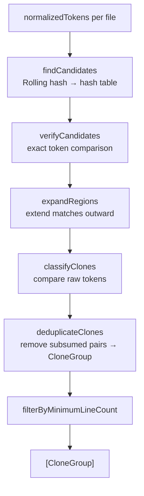

# Detection — Type 1 & 2

← [Detection Core](05-detection-core.md) | Next: [Detection — Type 3 →](07-detection-type3.md)

---

## CloneDetector

```swift
struct CloneDetector: DetectionAlgorithm
```

Detects exact (Type 1) and parameterized (Type 2) clones in a single pass over **normalized** tokens. Normalization replaces identifiers and literals with placeholders but preserves type and function callee names, so only code that uses the same types can match. Classification is deferred to the end, where raw tokens are compared to distinguish the two types.

```swift
init(minimumTokenCount: Int = 50, minimumLineCount: Int = 5)

let minimumTokenCount: Int
let minimumLineCount: Int

var supportedCloneTypes: Set<CloneType> { [.type1, .type2] }

func detect(files: [FileTokens]) -> [CloneGroup]
```

### Internal pipeline


```mermaid
flowchart TD
    A["normalizedTokens per file"] --> B["findCandidates\nRolling hash → hash table"]
    B --> C["verifyCandidates\nexact token comparison"]
    C --> D["expandRegions\nextend matches outward"]
    D --> E["classifyClones\ncompare raw tokens"]
    E --> F["deduplicateClones\nremove subsumed pairs → CloneGroup"]
    F --> G["filterByMinimumLineCount"]
    G --> H["[CloneGroup]"]
```

### findCandidates

Computes a rolling hash over a sliding window of `minimumTokenCount` normalized tokens for every position in every file. Files with fewer than `minimumTokenCount` normalized tokens are skipped. Positions that produce the same hash are grouped into a hash table. Entries with only one position are discarded (no match possible).

Returns `[UInt64: [TokenLocation]]`.

### verifyCandidates

For each hash-bucket with 2+ entries, compares all pairs of `TokenLocation` values by comparing the normalized token text within the window (guarding against hash collisions). Pairs in the same file whose offsets differ by less than `minimumTokenCount` are skipped (overlapping windows). Verified pairs become `ClonePair` values.

### expandRegions

Takes each `ClonePair` and extends it backward and forward one token at a time as long as the **normalized** token text at both sides still matches. This recovers clones that happen to be longer than `minimumTokenCount`.

### classifyClones

Compares **original** (`FileTokens.tokens`, non-normalized) token text over the same offsets and length for each pair. If every token text matches → `CloneType.type1`. If only normalized tokens match → `CloneType.type2`.

### deduplicateClones

Keeps a `ClassifiedClonePair` only if it neither is subsumed by nor subsumes a pair already kept (`isSubsumed` checked in both directions, first one wins). A pair is subsumed when, on both sides, it is in the same file as the other pair and its token range lies within the other pair's range. The surviving pairs are converted to `CloneGroup` (`similarity: 100.0`, `lineCount` = larger fragment line span, fragments built from raw `tokens`).

### filterByMinimumLineCount

Drops groups whose `lineCount` is below `minimumLineCount`.

---

## Supporting Types

### RollingHash

```swift
struct RollingHash: Sendable
```

Polynomial rolling hash with base `31` and modulus `10^9 + 7`. Provides O(1) window-slide updates. Each token contributes a per-token value computed by a private `tokenHash`: a djb2 hash (seed `5381`, `hash * 33 + byte`) over the token's UTF-8 `text`, reduced modulo the modulus — so only the text, not the kind or location, affects the hash.

```swift
func hash(_ tokens: [Token], offset: Int, count: Int) -> UInt64
```
Computes the hash of `tokens[offset ..< offset + count]` from scratch.

```swift
func rollingUpdate(
    hash: UInt64,
    removing: Token,
    adding: Token,
    highestPower: UInt64
) -> UInt64
```
Updates an existing hash by removing the outgoing token and adding the incoming one. `highestPower` must be `power(for: windowSize)`.

```swift
func power(for windowSize: Int) -> UInt64
```
Returns `base^(windowSize - 1) mod modulus`, computed once per `findCandidates` call.

### TokenLocation

```swift
struct TokenLocation: Hashable
let fileIndex: Int   // index into [FileTokens]
let offset: Int      // position within normalizedTokens
```

### ClonePair

```swift
struct ClonePair
let locationA: TokenLocation
let locationB: TokenLocation
let tokenCount: Int
```

An unclassified matched pair produced by `verifyCandidates` / `expandRegions`.

### ClassifiedClonePair

Defined in `ClassifiedPair.swift`.

```swift
struct ClassifiedClonePair
let type: CloneType   // .type1 or .type2
let tokenCount: Int
let locationA: TokenLocation
let locationB: TokenLocation
```

A pair after `classifyClones` has determined whether it is Type 1 or Type 2.

---

← [Detection Core](05-detection-core.md) | Next: [Detection — Type 3 →](07-detection-type3.md)
