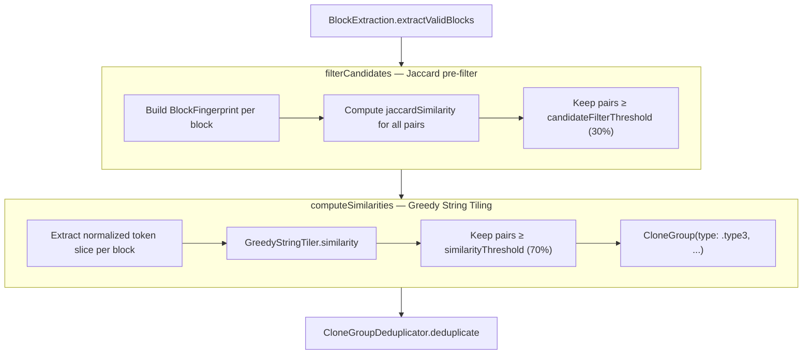
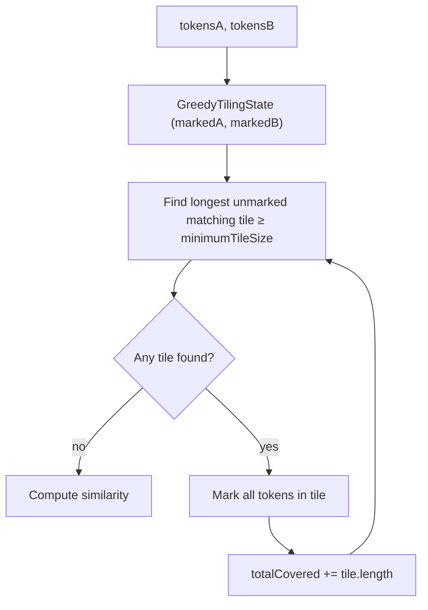

# Detection — Type 3

← [Detection — Type 1 & 2](06-detection-type12.md) | Next: [Detection — Type 4 →](08-detection-type4.md)

---

## Type3Detector

```swift
struct Type3Detector: DetectionAlgorithm
```

Detects near-miss clones: code fragments that are similar but not identical due to additions, deletions, or rearrangement of statements.

```swift
init(
    similarityThreshold: Double = 70.0,
    minimumTileSize: Int = 5,
    minimumTokenCount: Int = 50,
    minimumLineCount: Int = 5,
    candidateFilterThreshold: Double = 30.0
)

var supportedCloneTypes: Set<CloneType> { [.type3] }

func detect(files: [FileTokens]) -> [CloneGroup]
```

### Pipeline



### Type3CandidatePair

```swift
struct Type3CandidatePair
let blockA: IndexedBlock
let blockB: IndexedBlock
```

---

## BlockFingerprint

```swift
struct BlockFingerprint: Sendable, Equatable
```

A token-frequency map used as a cheap approximation of block similarity before running the more expensive GST algorithm.

```swift
init(tokens: [Token], startIndex: Int, endIndex: Int)

let tokenFrequencies: [String: Int]   // token text → occurrence count

func jaccardSimilarity(with other: BlockFingerprint) -> Double
```

`jaccardSimilarity` delegates to `BagJaccardSimilarity.calculate(_:_:)` passing the two `tokenFrequencies` dictionaries directly, avoiding re-allocation.

---

## BagJaccardSimilarity

```swift
enum BagJaccardSimilarity
```

Computes **Bag Jaccard** (multiset Jaccard) similarity, which accounts for repeated elements unlike standard Jaccard.

```
similarity = Σ min(freqA[t], freqB[t]) / Σ max(freqA[t], freqB[t])
             over all token types t in A ∪ B
```

Two overloads:

```swift
// Array overload — builds frequency maps then delegates
static func calculate<T: Hashable>(_ elementsA: [T], _ elementsB: [T]) -> Double

// Dictionary overload — the core algorithm
static func calculate<T: Hashable>(_ frequenciesA: [T: Int], _ frequenciesB: [T: Int]) -> Double
```

Both return `1.0` when both inputs are empty.

---

## GreedyStringTiler

```swift
struct GreedyStringTiler: Sendable
init(minimumTileSize: Int = 5)
func similarity(between tokensA: [Token], and tokensB: [Token]) -> Double
```

Implements the **Greedy String Tiling (GST)** algorithm. Finds the largest non-overlapping matching substrings (tiles) between two token sequences.

```
similarity = 2 × Σ tile.length / (|tokensA| + |tokensB|)
```

Returns `1.0` for identical inputs, `0.0` for no overlap.

### Algorithm



### GreedyTilingState

```swift
struct GreedyTilingState
init(sizeA: Int, sizeB: Int)

var markedA: [Bool]     // which tokens in A are already covered
var markedB: [Bool]     // which tokens in B are already covered
var totalCovered: Int   // running sum of covered tokens
```

### TileMatch

```swift
struct TileMatch
let startA:  Int   // start index in tokensA
let startB:  Int   // start index in tokensB
let length:  Int   // number of matched tokens
```

---

← [Detection — Type 1 & 2](06-detection-type12.md) | Next: [Detection — Type 4 →](08-detection-type4.md)
