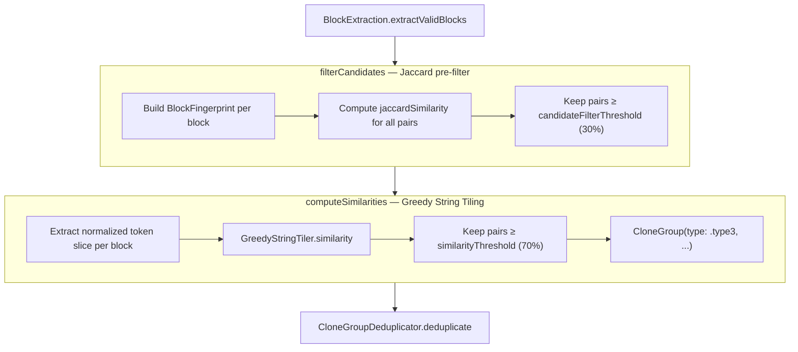
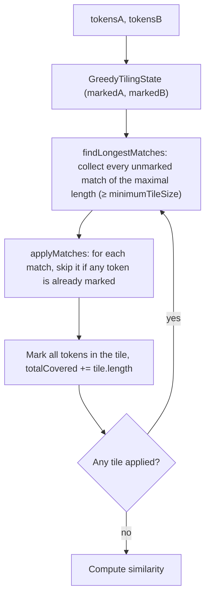

# Detection — Type 3

← [Detection — Type 1 & 2](06-detection-type12.md) | Next: [Detection — Type 4 →](08-detection-type4.md)

---

## Type3Detector

```swift
struct Type3Detector: DetectionAlgorithm
```

Detects near-miss clones: code fragments that are similar but not identical due to additions, deletions, or rearrangement of statements.

```swift
init(
    similarityThreshold: Double = 70.0,
    minimumTileSize: Int = 5,
    minimumTokenCount: Int = 50,
    minimumLineCount: Int = 5,
    candidateFilterThreshold: Double = 30.0
)

var supportedCloneTypes: Set<CloneType> { [.type3] }

func detect(files: [FileTokens]) -> [CloneGroup]
```

Both thresholds are percentages (`0–100`) and are divided by `100` before being compared against similarity scores in `0.0–1.0`.

### Pipeline


```mermaid
flowchart TD
    A["BlockExtraction.extractValidBlocks"] --> B

    subgraph B["filterCandidates — Jaccard pre-filter"]
        B1["Build BlockFingerprint per block"] --> B2["Compute jaccardSimilarity for all pairs"]
        B2 --> B3["Keep pairs ≥ candidateFilterThreshold (30%)"]
    end

    B --> C

    subgraph C["computeSimilarities — Greedy String Tiling"]
        C1["Extract normalized token slice per block"] --> C2["GreedyStringTiler.similarity"]
        C2 --> C3["Keep pairs ≥ similarityThreshold (70%)"]
        C3 --> C4["CloneGroup(type: .type3, ...)"]
    end

    C --> D["CloneGroupDeduplicator.deduplicate"]
```

Every unordered pair of blocks (`first < second`) is fingerprinted and compared — the pre-filter is quadratic in the number of valid blocks. Both the fingerprints and the GST token slices are taken from `FileTokens.normalizedTokens` over the inclusive range `startTokenIndex ... endTokenIndex`.

### Type3CandidatePair

```swift
struct Type3CandidatePair
let blockA: IndexedBlock
let blockB: IndexedBlock
```

A pair that survived the Jaccard pre-filter. Accepted pairs are wrapped in an `IndexedBlockPair` when the `CloneGroup` is built.

---

## BlockFingerprint

```swift
struct BlockFingerprint: Sendable, Equatable
```

A token-frequency map used as a cheap approximation of block similarity before running the more expensive GST algorithm.

```swift
init(tokens: [Token], startIndex: Int, endIndex: Int)   // inclusive range

let tokenFrequencies: [String: Int]   // token text → occurrence count

func jaccardSimilarity(with other: BlockFingerprint) -> Double
```

`jaccardSimilarity` delegates to `BagJaccardSimilarity.calculate(_:_:)` passing the two `tokenFrequencies` dictionaries directly, avoiding re-allocation.

---

## BagJaccardSimilarity

```swift
enum BagJaccardSimilarity
```

Computes **Bag Jaccard** (multiset Jaccard) similarity, which accounts for repeated elements unlike standard Jaccard.

```
similarity = Σ min(freqA[t], freqB[t]) / Σ max(freqA[t], freqB[t])
             over all token types t in A ∪ B
```

Two overloads:

```swift
// Array overload — builds frequency maps then delegates
static func calculate<T: Hashable>(_ elementsA: [T], _ elementsB: [T]) -> Double

// Dictionary overload — the core algorithm
static func calculate<T: Hashable>(_ frequenciesA: [T: Int], _ frequenciesB: [T: Int]) -> Double
```

Both return `1.0` when both inputs are empty. The array overload is also used by `BehaviorSignatureComparer` (data flow patterns) and `ASGComparer` (node kinds) — see [Detection — Type 4](08-detection-type4.md).

---

## GreedyStringTiler

```swift
struct GreedyStringTiler: Sendable
init(minimumTileSize: Int = 5)
func similarity(between tokensA: [Token], and tokensB: [Token]) -> Double
```

Implements the **Greedy String Tiling (GST)** algorithm. Finds the largest non-overlapping matching substrings (tiles) between two token sequences. Tokens are compared by `text`.

```
similarity = 2 × Σ tile.length / (|tokensA| + |tokensB|)
```

Returns `0.0` when both inputs are empty or no tile of at least `minimumTileSize` tokens exists. Identical inputs of at least `minimumTileSize` tokens score `1.0`.

### Algorithm


```mermaid
flowchart TD
    A["tokensA, tokensB"] --> B["GreedyTilingState (markedA, markedB)"]
    B --> C["findLongestMatches: collect every unmarked match of the maximal length (≥ minimumTileSize)"]
    C --> D["applyMatches: for each match, skip it if any token is already marked"]
    D --> F["Mark all tokens in the tile, totalCovered += tile.length"]
    F --> G{Any tile applied?}
    G -- yes --> C
    G -- no --> E["Compute similarity"]
```

Each iteration scans all unmarked `(indexA, indexB)` start positions, so a single pass is `O(|A| × |B| × tile length)`.

### GreedyTilingState

Declared in `TilingState.swift`.

```swift
struct GreedyTilingState
init(sizeA: Int, sizeB: Int)

var markedA: [Bool]     // which tokens in A are already covered
var markedB: [Bool]     // which tokens in B are already covered
var totalCovered: Int = 0   // running sum of covered tokens
```

### TileMatch

```swift
struct TileMatch
let startA:  Int   // start index in tokensA
let startB:  Int   // start index in tokensB
let length:  Int   // number of matched tokens
```

---

← [Detection — Type 1 & 2](06-detection-type12.md) | Next: [Detection — Type 4 →](08-detection-type4.md)
