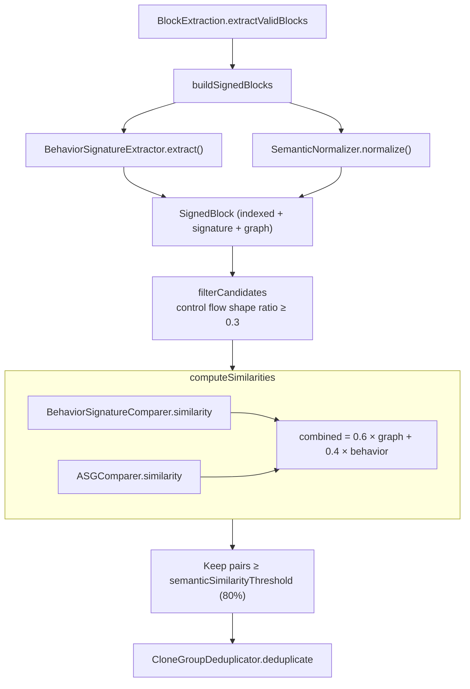

# Detection — Type 4

← [Detection — Type 3](07-detection-type3.md) | Next: [Reporting →](09-reporting.md)

---

## Type4Detector

```swift
struct Type4Detector: DetectionAlgorithm
```

Detects semantically equivalent clones: code that achieves the same result through different implementations. Each block is analysed to produce two complementary representations — a `BehaviorSignature` and an `AbstractSemanticGraph` — which are then compared.

```swift
init(
    semanticSimilarityThreshold: Double = 80.0,
    minimumTokenCount: Int = 50,
    minimumLineCount: Int = 5
)

var supportedCloneTypes: Set<CloneType> { [.type4] }

func detect(files: [FileTokens]) -> [CloneGroup]
```

### Pipeline



### Pre-filter

Pairs are filtered before scoring using the ratio of control flow shape lengths:

```
ratio = min(|shapeA|, |shapeB|) / max(|shapeA|, |shapeB|)
```

Pairs with `ratio < 0.3` are discarded. Pairs where both shapes are empty always pass (no control flow means structurally similar).

### Type4CandidatePair

```swift
struct Type4CandidatePair
let blockA: SignedBlock
let blockB: SignedBlock
```

### SignedBlock

```swift
struct SignedBlock
let indexed:   IndexedBlock
let signature: BehaviorSignature
let graph:     AbstractSemanticGraph
```

---

## BehaviorSignature

```swift
struct BehaviorSignature: Sendable, Equatable
```

A compact, language-agnostic fingerprint of what a code block *does*.

```swift
let controlFlowShape:  [ControlFlowNode]   // ordered sequence of control flow statements
let dataFlowPatterns:  [DataFlowPattern]   // how variables are defined and used
let calledFunctions:   Set<String>         // names of all called functions
let typeSignatures:    Set<String>         // type names referenced
```

### ControlFlowNode

```swift
enum ControlFlowNode: String, Sendable, Equatable, Hashable
```

| Case | Source construct |
|---|---|
| `.ifStatement` | `if` |
| `.guardStatement` | `guard` |
| `.switchStatement` | `switch` |
| `.forLoop` | `for … in` |
| `.whileLoop` | `while` |
| `.repeatLoop` | `repeat … while` |
| `.doCatch` | `do … catch` |
| `.returnStatement` | `return` |
| `.throwStatement` | `throw` |
| `.breakStatement` | `break` |
| `.continueStatement` | `continue` |

### DataFlowPattern

```swift
enum DataFlowPattern: String, Sendable, Equatable, Hashable
```

| Case | Meaning |
|---|---|
| `.defineAndUse` | Variable is both bound and referenced in the block |
| `.defineOnly` | Variable is bound but never referenced |
| `.useOnly` | Variable is referenced but bound outside the block |
| `.parameterUse` | A function parameter is referenced |

---

## BehaviorSignatureExtractor

```swift
final class BehaviorSignatureExtractor: RangedSyntaxVisitor
```

A swift-syntax `SyntaxVisitor` that walks a source range and accumulates the fields of a `BehaviorSignature`. Inherits range-gating from `RangedSyntaxVisitor`.

```swift
func extract() -> BehaviorSignature
```

Runs the walk (via `run()`) and returns the accumulated signature. Uses `private var` for all accumulation state to ensure Swift 6 concurrency safety.

Visited nodes and their effect:

| Node | Effect |
|---|---|
| `IfExprSyntax` | append `.ifStatement` to shape |
| `GuardStmtSyntax` | append `.guardStatement` |
| `SwitchExprSyntax` | append `.switchStatement` |
| `ForStmtSyntax` | append `.forLoop` |
| `WhileStmtSyntax` | append `.whileLoop` |
| `RepeatStmtSyntax` | append `.repeatLoop` |
| `DoStmtSyntax` | append `.doCatch` |
| `ReturnStmtSyntax` | append `.returnStatement` |
| `ThrowStmtSyntax` | append `.throwStatement` |
| `BreakStmtSyntax` | append `.breakStatement` |
| `ContinueStmtSyntax` | append `.continueStatement` |
| `FunctionCallExprSyntax` | add extracted name to `calledFunctions` |
| `PatternBindingSyntax` | determine and append `DataFlowPattern` |
| `DeclReferenceExprSyntax` | track variable use |
| `FunctionParameterSyntax` | append `.parameterUse` |
| `ReturnClauseSyntax` | add return type to `typeSignatures` |
| `IdentifierTypeSyntax` | add type name to `typeSignatures` |

### BehaviorSignatureComparer

```swift
struct BehaviorSignatureComparer: Sendable
func similarity(between signatureA: BehaviorSignature, and signatureB: BehaviorSignature) -> Double
```

Combines four sub-scores into an overall similarity:

| Component | Algorithm |
|---|---|
| Control flow shape | `LCSCalculator.similarity` over `[ControlFlowNode]` |
| Data flow patterns | `LCSCalculator.similarity` over `[DataFlowPattern]` |
| Called functions | Jaccard of sets |
| Type signatures | Jaccard of sets |

### FunctionNameExtractor

```swift
enum FunctionNameExtractor
static func extract(from expression: ExprSyntax) -> String
```

Extracts a printable function name from a call expression. Handles member access (`receiver.method`), identifiers, and falls back to `"closure"` for anonymous closures.

---

## AbstractSemanticGraph (ASG)

A directed graph of semantic nodes connected by control-flow and data-flow edges, built by `SemanticNormalizer`.

### AbstractSemanticGraph

```swift
struct AbstractSemanticGraph: Sendable, Equatable
let nodes: [SemanticNode]
let edges: [SemanticEdge]
```

### SemanticNode

```swift
struct SemanticNode: Sendable, Equatable, Hashable
let id:   Int
let kind: SemanticNodeKind
```

### SemanticEdge

```swift
struct SemanticEdge: Sendable, Equatable, Hashable
let from: Int
let to:   Int
let kind: SemanticEdgeKind
```

### SemanticNodeKind

```swift
enum SemanticNodeKind: String, Sendable, Equatable, Hashable, CaseIterable
```

| Case | Represents |
|---|---|
| `.assignment` | Variable binding (`let x = …`) |
| `.functionCall` | Call expression |
| `.returnValue` | `return` with a value |
| `.conditional` | `if`, `guard`, `switch` |
| `.loop` | `for`, `while`, `repeat`, `forEach` |
| `.guardExit` | `guard-else-return/throw` |
| `.errorHandling` | `do-catch`, `throw` |
| `.collectionOperation` | `map`, `filter`, `reduce`, `sorted`, … |
| `.optionalUnwrap` | `if let`, `guard let` |
| `.parameterInput` | Function parameter |
| `.literalValue` | Constant literal outside a binding |

### SemanticEdgeKind

```swift
enum SemanticEdgeKind: String, Sendable, Equatable, Hashable
```

| Case | Meaning |
|---|---|
| `.controlFlow` | Sequential execution order between nodes |
| `.dataFlow` | A node's value is used by another node |

---

## SemanticNormalizer

```swift
final class SemanticNormalizer: RangedSyntaxVisitor
func normalize() -> AbstractSemanticGraph
```

A swift-syntax `SyntaxVisitor` that builds an `AbstractSemanticGraph` by visiting a restricted source range. Inherits `isInRange` from `RangedSyntaxVisitor`.

`normalize()` resets all internal state before each `run()` call, making the instance reusable.

Nodes are connected by `.controlFlow` edges in visit order. `.dataFlow` edges connect a `.literalValue` node to the `.assignment` node it initializes.

---

## ASGComparer

```swift
struct ASGComparer: Sendable
func similarity(between graphA: AbstractSemanticGraph, and graphB: AbstractSemanticGraph) -> Double
```

Compares two `AbstractSemanticGraph` values using:

1. **Node kind distribution** — Bag Jaccard over the multiset of `SemanticNodeKind` values.
2. **Edge kind distribution** — Bag Jaccard over the multiset of `SemanticEdgeKind` values.

The two scores are averaged. Returns `1.0` when both graphs are empty.

---

## LCSCalculator

```swift
enum LCSCalculator
```

Computes Longest Common Subsequence (LCS) similarity between two sequences using dynamic programming.

```swift
static func length<T: Equatable>(_ sequenceA: [T], _ sequenceB: [T]) -> Int
static func similarity<T: Equatable>(_ sequenceA: [T], _ sequenceB: [T]) -> Double
```

`similarity` returns `2 × lcs / (|A| + |B|)`. Returns `1.0` for two empty sequences.

Used by `BehaviorSignatureComparer` to compare `[ControlFlowNode]` and `[DataFlowPattern]` sequences in order, rewarding blocks that have the same control flow in the same order.

---

← [Detection — Type 3](07-detection-type3.md) | Next: [Reporting →](09-reporting.md)
