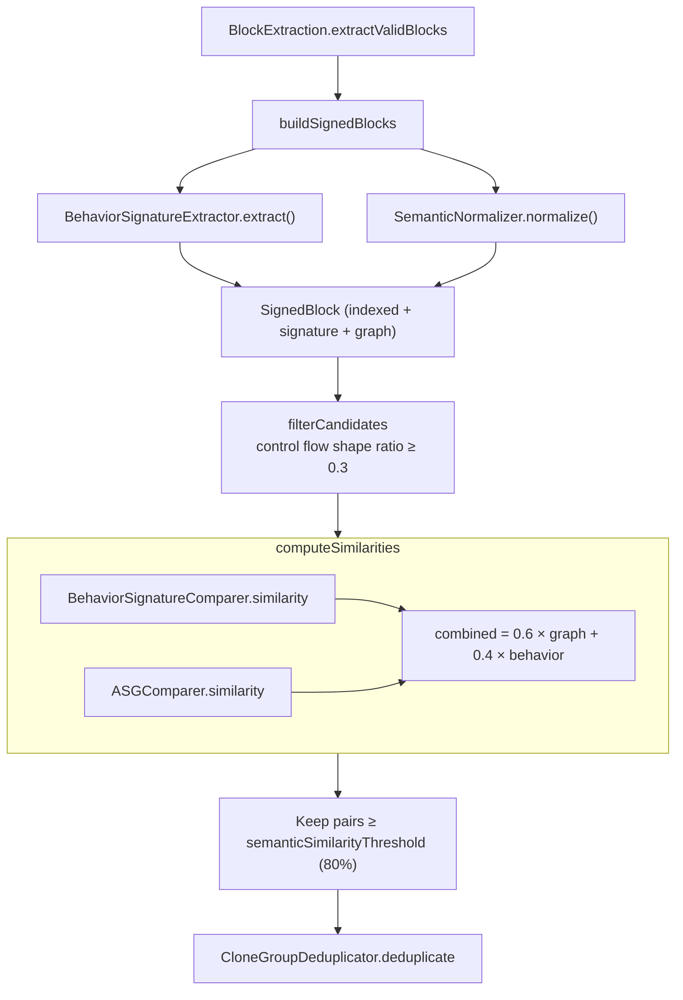

# Detection — Type 4

← [Detection — Type 3](07-detection-type3.md) | Next: [Reporting →](09-reporting.md)

---

## Type4Detector

```swift
struct Type4Detector: DetectionAlgorithm
```

Detects semantically equivalent clones: code that achieves the same result through different implementations. Each block is analysed to produce two complementary representations — a `BehaviorSignature` and an `AbstractSemanticGraph` — which are then compared.

```swift
init(
    semanticSimilarityThreshold: Double = 80.0,
    minimumTokenCount: Int = 50,
    minimumLineCount: Int = 5
)

var supportedCloneTypes: Set<CloneType> { [.type4] }

func detect(files: [FileTokens]) -> [CloneGroup]
```

`semanticSimilarityThreshold` is a percentage (`0–100`) and is divided by `100` before being compared against the combined score.

### Pipeline


```mermaid
flowchart TD
    A["BlockExtraction.extractValidBlocks"] --> B["buildSignedBlocks"]
    B --> BS["BehaviorSignatureExtractor.extract()"]
    B --> SN["SemanticNormalizer.normalize()"]
    BS --> SB["SignedBlock (indexed + signature + graph)"]
    SN --> SB

    SB --> C["filterCandidates\ncontrol flow shape ratio ≥ 0.3"]
    C --> D["computeSimilarities"]

    subgraph D["computeSimilarities"]
        D1["BehaviorSignatureComparer.similarity"] --> score
        D2["ASGComparer.similarity"] --> score
        score["combined = 0.6 × graph + 0.4 × behavior"]
    end

    D --> E["Keep pairs ≥ semanticSimilarityThreshold (80%)"]
    E --> F["CloneGroupDeduplicator.deduplicate"]
```

### Pre-filter

Pairs are filtered before scoring using the ratio of control flow shape lengths:

```
ratio = min(|shapeA|, |shapeB|) / max(|shapeA|, |shapeB|)
```

Pairs with `ratio < 0.3` are discarded. Pairs where both shapes are empty always pass (no control flow means structurally similar). Every unordered pair of signed blocks is tested.

`buildSignedBlocks` creates a fresh `BehaviorSignatureExtractor` and `SemanticNormalizer` for each block, passing the file's full `source` together with the block's `startLine`/`endLine`. Each visitor parses the whole file and only records nodes inside the line range (see `RangedSyntaxVisitor` in [Detection — Core](05-detection-core.md)).

### Type4CandidatePair

```swift
struct Type4CandidatePair
let blockA: SignedBlock
let blockB: SignedBlock
```

### SignedBlock

```swift
struct SignedBlock
let indexed:   IndexedBlock
let signature: BehaviorSignature
let graph:     AbstractSemanticGraph
```

---

## BehaviorSignature

```swift
struct BehaviorSignature: Sendable, Equatable
```

A compact, language-agnostic fingerprint of what a code block *does*.

```swift
let controlFlowShape:  [ControlFlowNode]   // ordered sequence of control flow statements
let dataFlowPatterns:  [DataFlowPattern]   // one entry per variable name, sorted by rawValue
let calledFunctions:   Set<String>         // names of all called functions
let typeSignatures:    Set<String>         // type names referenced
```

### ControlFlowNode

```swift
enum ControlFlowNode: String, Sendable, Equatable, Hashable
```

| Case | Source construct |
|---|---|
| `.ifStatement` | `if` |
| `.guardStatement` | `guard` |
| `.switchStatement` | `switch` |
| `.forLoop` | `for … in` |
| `.whileLoop` | `while` |
| `.repeatLoop` | `repeat … while` |
| `.doCatch` | `do … catch` |
| `.returnStatement` | `return` |
| `.throwStatement` | `throw` |
| `.breakStatement` | `break` |
| `.continueStatement` | `continue` |

### DataFlowPattern

```swift
enum DataFlowPattern: String, Sendable, Equatable, Hashable
```

| Case | Meaning |
|---|---|
| `.defineAndUse` | Name is bound in the block (`PatternBindingSyntax`) and also referenced |
| `.defineOnly` | Name is bound in the block but never referenced |
| `.useOnly` | Name is referenced but not bound in the block and is not a parameter name |
| `.parameterUse` | Name is referenced, not bound in the block, and matches a parameter declared in range |

Names are tracked as sets, so each distinct name contributes exactly one pattern regardless of how many times it appears.

---

## BehaviorSignatureExtractor

```swift
final class BehaviorSignatureExtractor: RangedSyntaxVisitor
```

A swift-syntax `SyntaxVisitor` that walks a source range and accumulates the fields of a `BehaviorSignature`. Inherits range-gating from `RangedSyntaxVisitor`.

```swift
func extract() -> BehaviorSignature
```

Runs the walk (via `run()`) and returns the accumulated signature. Accumulation state is held in `private var`s and is **not** reset between calls, so each instance is meant to be used for a single `extract()`.

Visited nodes and their effect:

| Node | Effect |
|---|---|
| `IfExprSyntax` | append `.ifStatement` to shape |
| `GuardStmtSyntax` | append `.guardStatement` |
| `SwitchExprSyntax` | append `.switchStatement` |
| `ForStmtSyntax` | append `.forLoop` |
| `WhileStmtSyntax` | append `.whileLoop` |
| `RepeatStmtSyntax` | append `.repeatLoop` |
| `DoStmtSyntax` | append `.doCatch` |
| `ReturnStmtSyntax` | append `.returnStatement` |
| `ThrowStmtSyntax` | append `.throwStatement` |
| `BreakStmtSyntax` | append `.breakStatement` |
| `ContinueStmtSyntax` | append `.continueStatement` |
| `FunctionCallExprSyntax` | add `FunctionNameExtractor` name to `calledFunctions` |
| `PatternBindingSyntax` | record `pattern.trimmedDescription` as a defined variable |
| `DeclReferenceExprSyntax` | record `baseName` as a used variable |
| `FunctionParameterSyntax` | record the parameter name (`secondName ?? firstName`); add its type to `typeSignatures` when it is an `IdentifierTypeSyntax` |
| `ReturnClauseSyntax` | add the return type to `typeSignatures` when it is an `IdentifierTypeSyntax` |
| `IdentifierTypeSyntax` | add type name to `typeSignatures` |

Each node is only recorded when `isInRange` holds; children are always visited. `DataFlowPattern`s are derived after the walk from the defined, used and parameter name sets (see the table above).

### BehaviorSignatureComparer

```swift
struct BehaviorSignatureComparer: Sendable
func similarity(between signatureA: BehaviorSignature, and signatureB: BehaviorSignature) -> Double
```

Combines four sub-scores into a weighted overall similarity:

| Component | Algorithm | Weight |
|---|---|---|
| Control flow shape | `LCSCalculator.similarity` over `[ControlFlowNode]` | 0.4 |
| Data flow patterns | `BagJaccardSimilarity.calculate` over `[DataFlowPattern]` | 0.3 |
| Called functions | Jaccard of sets (`1.0` when both are empty) | 0.2 |
| Type signatures | Jaccard of sets (`1.0` when both are empty) | 0.1 |

### FunctionNameExtractor

```swift
enum FunctionNameExtractor
static func extract(from expression: ExprSyntax) -> String
```

Extracts a printable function name from a call's `calledExpression`:

- `MemberAccessExprSyntax` → the member name only (`items.map` → `"map"`).
- `DeclReferenceExprSyntax` → the identifier (`print` → `"print"`).
- Anything else → `expression.trimmedDescription`.

Used by both `BehaviorSignatureExtractor` and `SemanticNormalizer`.

---

## AbstractSemanticGraph (ASG)

A directed graph of semantic nodes connected by control-flow and data-flow edges, built by `SemanticNormalizer`.

### AbstractSemanticGraph

```swift
struct AbstractSemanticGraph: Sendable, Equatable
let nodes: [SemanticNode]
let edges: [SemanticEdge]
```

### SemanticNode

```swift
struct SemanticNode: Sendable, Equatable, Hashable
let id:   Int
let kind: SemanticNodeKind
```

### SemanticEdge

```swift
struct SemanticEdge: Sendable, Equatable, Hashable
let from: Int
let to:   Int
let kind: SemanticEdgeKind
```

### SemanticNodeKind

```swift
enum SemanticNodeKind: String, Sendable, Equatable, Hashable, CaseIterable
```

| Case | Represents |
|---|---|
| `.assignment` | Pattern binding (`let x = …`) |
| `.functionCall` | Call expression that is neither `forEach` nor a collection operation |
| `.returnValue` | Any `return` statement |
| `.conditional` | `guard`, `switch`, or an `if` without an optional binding |
| `.loop` | `for`, `while`, `repeat`, or a call named `forEach` |
| `.guardExit` | `guard` whose body contains `return`/`throw`, or a negated `if` (`!…`) whose body contains `return`/`throw` |
| `.errorHandling` | `do`, `throw` |
| `.collectionOperation` | Call named `map`, `flatMap`, `compactMap`, `filter`, `reduce`, `sorted`, `sort`, `contains`, `first`, `last`, `prefix`, `suffix`, `dropFirst`, `dropLast` |
| `.optionalUnwrap` | `if let` (replaces `.conditional`) or `guard let` (added after `.conditional`) |
| `.parameterInput` | Function parameter |
| `.literalValue` | Integer, string, float or boolean literal outside a pattern binding, or the literal initializer of a binding |

### SemanticEdgeKind

```swift
enum SemanticEdgeKind: String, Sendable, Equatable, Hashable
```

| Case | Meaning |
|---|---|
| `.controlFlow` | Sequential execution order between nodes |
| `.dataFlow` | A node's value is used by another node |

---

## SemanticNormalizer

```swift
final class SemanticNormalizer: RangedSyntaxVisitor
func normalize() -> AbstractSemanticGraph
```

A swift-syntax `SyntaxVisitor` that builds an `AbstractSemanticGraph` by visiting a restricted source range. Inherits `isInRange` from `RangedSyntaxVisitor`.

`normalize()` resets all internal state before each `run()` call, making the instance reusable.

Edges are added in two stages:

1. **During the walk**
   - `.controlFlow` from a `guard`'s `.conditional` node to its `.guardExit` / `.optionalUnwrap` node, and from a negated `if`'s `.conditional` node to its `.guardExit` node.
   - `.dataFlow` from a literal initializer's `.literalValue` node to the `.assignment` node it initializes.
   - `.dataFlow` from a variable's `.assignment` node to the most recently added node whenever a `DeclReferenceExprSyntax` refers to that variable (skipped when both are the same node).
2. **In `buildGraph()`** — when there is more than one node, a `.controlFlow` edge links each node to the next one in visit order, unless an identical edge already exists. These sequential edges are appended after the walk edges.

---

## ASGComparer

```swift
struct ASGComparer: Sendable
func similarity(between graphA: AbstractSemanticGraph, and graphB: AbstractSemanticGraph) -> Double
```

Compares two `AbstractSemanticGraph` values using:

1. **Node kind distribution** — `BagJaccardSimilarity` over the multiset of `SemanticNodeKind` values (weight `0.6`).
2. **Edge kind sequence** — `LCSCalculator.similarity` over the ordered `SemanticEdgeKind` values of each graph's edges (weight `0.4`).

```
similarity = 0.6 × nodeSimilarity + 0.4 × edgeSimilarity
```

Returns `1.0` when both graphs have no nodes, and `0.0` when exactly one of them has no nodes.

---

## LCSCalculator

```swift
enum LCSCalculator
```

Computes Longest Common Subsequence (LCS) similarity between two sequences using dynamic programming.

```swift
static func length<T: Equatable>(_ sequenceA: [T], _ sequenceB: [T]) -> Int
static func similarity<T: Equatable>(_ sequenceA: [T], _ sequenceB: [T]) -> Double
```

`length` uses a two-row DP table and returns `0` when either sequence is empty. `similarity` returns `2 × lcs / (|A| + |B|)`, and `1.0` for two empty sequences.

Used by `BehaviorSignatureComparer` to compare `[ControlFlowNode]` sequences and by `ASGComparer` to compare edge kind sequences, rewarding blocks that have the same structure in the same order.

---

← [Detection — Type 3](07-detection-type3.md) | Next: [Reporting →](09-reporting.md)
