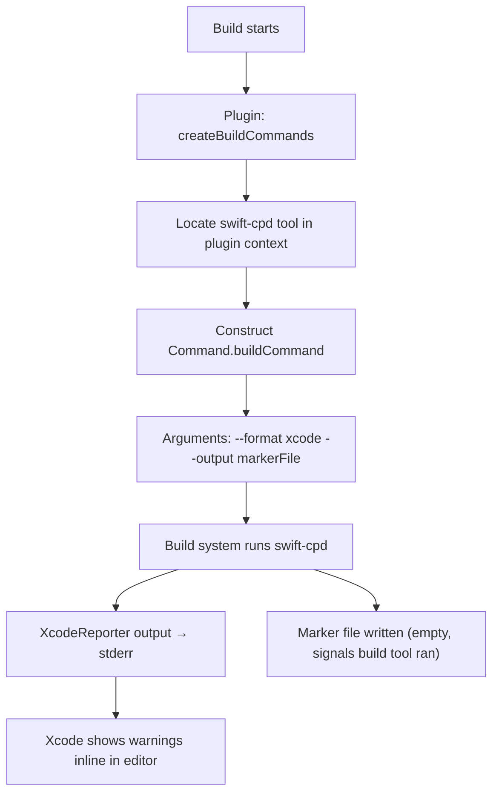

# Plugin

← [Cache & Baseline](10-cache-baseline.md) | [Index →](README.md)

---

## SwiftCPDPlugin

```swift
@main struct SwiftCPDPlugin: BuildToolPlugin
extension SwiftCPDPlugin: XcodeBuildToolPlugin
```

A Swift Package Manager and Xcode build tool plugin that runs `swift-cpd` automatically as part of the build. It conforms to both `BuildToolPlugin` (SPM) and `XcodeBuildToolPlugin` (Xcode), sharing the same command construction logic.

### SPM entry point

```swift
func createBuildCommands(
    context: PluginContext,
    target: Target
) async throws -> [Command]
```

### Xcode entry point

```swift
func createBuildCommands(
    context: XcodePluginContext,
    target: XcodeTarget
) throws -> [Command]
```

### How it works



The plugin uses `--format xcode` so the output is in the `file:line: warning:` format that Xcode's build system interprets as inline editor diagnostics.

A **marker file** (empty file written to the plugin's work directory) is declared as the command's output. This tells the build system that the command ran successfully and prevents it from re-running on unchanged inputs.

### Integration in Package.swift

```swift
.plugin(
    name: "SwiftCPDPlugin",
    capability: .buildTool(),
    dependencies: [.target(name: "swift-cpd")]
)
```

Add to a target via:

```swift
.target(
    name: "MyTarget",
    plugins: [.plugin(name: "SwiftCPDPlugin")]
)
```

---

← [Cache & Baseline](10-cache-baseline.md) | [Index →](README.md)
