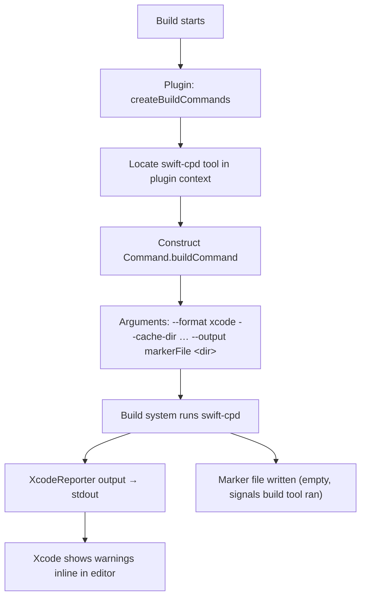

# Plugin

← [Cache & Baseline](10-cache-baseline.md) | Next: [Source IO (Git Refs) →](12-source-io.md)

---

## SwiftCPDPlugin

```swift
@main struct SwiftCPDPlugin: BuildToolPlugin
extension SwiftCPDPlugin: XcodeBuildToolPlugin
```

A Swift Package Manager and Xcode build tool plugin that runs `swift-cpd` automatically as part of the build. It conforms to both `BuildToolPlugin` (SPM) and `XcodeBuildToolPlugin` (Xcode); the `XcodeBuildToolPlugin` conformance is compiled only when `XcodeProjectPlugin` can be imported (`#if canImport(XcodeProjectPlugin)`). The two entry points build the command independently and differ only in the analyzed directory and the display name (see the table below).

### SPM entry point

```swift
func createBuildCommands(
    context: PluginContext,
    target: Target
) async throws -> [Command]
```

Returns no commands when `target` is not a `SourceModuleTarget`.

### Xcode entry point

```swift
func createBuildCommands(
    context: XcodePluginContext,
    target: XcodeTarget
) throws -> [Command]
```

### How it works


```mermaid
flowchart TD
    B["Build starts"] --> P["Plugin: createBuildCommands"]
    P --> L["Locate swift-cpd tool in plugin context"]
    L --> C["Construct Command.buildCommand"]
    C --> A["Arguments: --format xcode --cache-dir … --output markerFile &lt;dir&gt;"]
    A --> R["Build system runs swift-cpd"]
    R --> X["XcodeReporter output → stdout"]
    X --> W["Xcode shows warnings inline in editor"]
    R --> M["Marker file written (empty, signals build tool ran)"]
```

Both entry points return a single `Command.buildCommand` with:

| | SPM (`BuildToolPlugin`) | Xcode (`XcodeBuildToolPlugin`) |
|---|---|---|
| Display name | `SwiftCPD: Detecting clones in <target>` | `SwiftCPD: Detecting clones` |
| Analyzed path (positional argument) | `sourceTarget.directoryURL` (the target's source directory) | `context.xcodeProject.directoryURL` (the whole project directory, regardless of target) |

Shared arguments and environment, all rooted in `context.pluginWorkDirectoryURL`:

| Argument / variable | Value | Purpose |
|---|---|---|
| `--format xcode` | — | Emits `file:line:column: warning: …` lines that the build system turns into inline editor diagnostics |
| `--cache-dir` | `<pluginWorkDirectory>/cache` | Keeps the token cache inside the build's plugin work directory instead of `.swift-cpd-cache` in the working directory |
| `--output` | `<pluginWorkDirectory>/swift-cpd.marker` | Marker file path, also declared as the command's only `outputFiles` entry |
| `LLVM_PROFILE_FILE` | `<pluginWorkDirectory>/default.profraw` | Redirects any LLVM coverage profile written by an instrumented `swift-cpd` binary into the plugin work directory |

No input files are declared, and no `--config` argument is passed.

With `--format xcode`, `swift-cpd` prints the report to **stdout** (even when `--output` is given), then writes an **empty marker file** to the `--output` path, creating its directory if needed, and exits with code `0` — `--max-duplication` is not evaluated in this format. Errors before reporting (for example, no source files found, or an invalid configuration) still exit non-zero. The marker file is the declared output that tells the build system the command produced its result.

Because the plugin passes a positional path, any `paths:` in `.swift-cpd.yml` is ignored (CLI paths take precedence over YAML paths). The YAML file itself is only read if `.swift-cpd.yml` exists in the process's current working directory, which the plugin does not set.

### Integration in Package.swift

```swift
.plugin(
    name: "SwiftCPDPlugin",
    capability: .buildTool(),
    dependencies: ["swift-cpd"]
)
```

The package also exports it as a product: `.plugin(name: "SwiftCPDPlugin", targets: ["SwiftCPDPlugin"])`.

A consuming package adds it to a target via:

```swift
.target(
    name: "MyTarget",
    plugins: [.plugin(name: "SwiftCPDPlugin", package: "swift-cpd")]
)
```

---

← [Cache & Baseline](10-cache-baseline.md) | Next: [Source IO (Git Refs) →](12-source-io.md)
