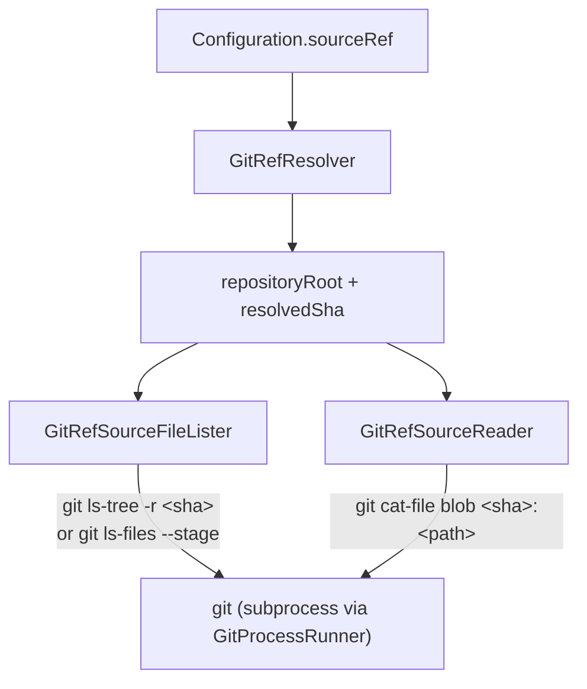

# Source IO (Git Refs)

← [Plugin](11-plugin.md) | [Index →](README.md)

---

## Overview

When `Configuration.sourceRef` is set, the IO module reads file content from a git ref instead of the working tree. The pipeline never knows the difference — it sees a `SourceFileLister` and a `SourceReader` regardless of where the bytes originate. See [File Discovery & Source IO](02-file-discovery.md) for the protocol-level overview; this chapter documents the git-backed implementations.



The git layer is composed of seven types, each in its own file:

| Type | Responsibility |
|---|---|
| `SourceRefError` | Tagged errors raised across the IO layer |
| `GitProcessRunner` | Spawns `git` as a subprocess and returns its output |
| `GitProcessRunner.ProcessOutput` | stdout + stderr + exitCode triple |
| `GitRefResolver` | Resolves a user-provided ref into repo root + sha |
| `GitRefResolver.Resolved` | Output of `resolve(ref:in:)` |
| `GitRefSourceFileLister` | Lists files under `paths:` from a ref's tree |
| `GitRefSourceFileLister.TreeEntry` | One line of `git ls-tree`/`ls-files` output |
| `GitRefSourceReader` | Reads a single blob from a ref |
| `repositoryRelativePath(for:in:)` | Free function — normalizes any path to repo-root-relative |

---

## SourceRefError

```swift
enum SourceRefError: Error, Equatable, Sendable
```

| Case | Trigger |
|---|---|
| `.gitExecutableNotFound` | `git` is missing from `PATH` (spawn fails or `env` returns 127) |
| `.notARepository(workingDirectory:)` | `git rev-parse --show-toplevel` fails — caller is not inside a repo |
| `.unknownRef(ref:)` | `git rev-parse --verify <ref>` rejects the ref |
| `.gitCommandFailed(command:, exitCode:, stderr:)` | A git subcommand exited non-zero (anything other than the above) |

---

## GitProcessRunner

```swift
struct GitProcessRunner: Sendable
init(environment: [String: String]? = nil)
```

Thin wrapper over `Foundation.Process`. The optional `environment` overrides the process environment — primarily used in tests to set `PATH=""` and verify the `gitExecutableNotFound` path.

```swift
func run(args: [String], workingDirectory: String) throws -> ProcessOutput
```

- Executes `/usr/bin/env git <args...>` from the given working directory.
- If `Process.run()` itself throws → `SourceRefError.gitExecutableNotFound`.
- If exit code is `127` (env-couldn't-find-git) → `SourceRefError.gitExecutableNotFound`.
- Otherwise returns the captured stdout, stderr, and exit code.

```swift
struct GitProcessRunner.ProcessOutput: Sendable
let stdout:   Data
let stderr:   String
let exitCode: Int32
```

---

## GitRefResolver

```swift
struct GitRefResolver: Sendable
init(runner: GitProcessRunner = .init())
func resolve(ref: String, in workingDirectory: String) throws -> Resolved
```

Resolves a user-provided ref to a stable identifier:

1. `git rev-parse --show-toplevel` from the working directory → repository root.
   - Fails with `notARepository` if not inside a repo.
2. If `ref == ":0"` → returns the literal `:0` as the resolved sha (the index has no single sha).
3. Otherwise `git rev-parse --verify --quiet <ref>` → 40-char sha.
   - Fails with `unknownRef(ref:)` on any non-zero exit or empty stdout.

```swift
struct GitRefResolver.Resolved: Equatable, Sendable
let repositoryRoot: String
let resolvedSha:    String
```

The resolved sha is what gets used downstream both as the git object spec (for `cat-file`/`ls-tree`) and as the cache namespace key. Mutable refs like `HEAD` or `main` are resolved once at the start of the run — moving the ref between subsequent runs cleanly misses the cache without contaminating prior entries.

---

## GitRefSourceFileLister

```swift
struct GitRefSourceFileLister: SourceFileLister
init(
    ref: String,
    resolvedSha: String,
    repositoryRoot: String,
    crossLanguageEnabled: Bool,
    excludePatterns: [String] = [],
    runner: GitProcessRunner = .init(),
    stderr: @escaping @Sendable (String) -> Void = { FileHandle.standardError.write(Data($0.utf8)) }
)
func listFiles(in paths: [String]) throws -> [String]
```

For each input path:

1. Convert to repo-relative via `repositoryRelativePath(for:in:)`. Out-of-repo paths throw `FileDiscoveryError.pathOutsideRepository`.
2. Run the listing command:
   - Named ref / sha: `git ls-tree -r <resolvedSha> -- <relativePath>`
   - Index (`resolvedSha == ":0"`): `git ls-files --stage -- <relativePath>`
3. Empty output → `FileDiscoveryError.pathDoesNotExistInRef(path:, ref:)`.
4. Parse each line into a `TreeEntry`, skip submodules (mode `160000`) with a warning to the injected `stderr` closure, filter by extension and `excludePatterns` via `GlobMatcher`, and return absolute paths.

```swift
struct GitRefSourceFileLister.TreeEntry: Equatable, Sendable
static let submoduleMode = "160000"
let mode: String
let path: String
var isSubmodule: Bool { mode == Self.submoduleMode }
```

---

## GitRefSourceReader

```swift
struct GitRefSourceReader: SourceReader
init(ref: String, resolvedSha: String, repositoryRoot: String, runner: GitProcessRunner = .init())
func read(file: String) throws -> Data
```

1. Convert `file` to repo-relative via `repositoryRelativePath(for:in:)`.
2. Run `git cat-file blob <resolvedSha>:<relativePath>`.
3. Non-zero exit → `SourceRefError.gitCommandFailed(...)` with the git stderr verbatim — typically because the file does not exist at the ref.

The reader returns raw bytes without assuming UTF-8; the `AnalysisPipeline` decodes when it needs a `String`.

---

## repositoryRelativePath(for:in:)

```swift
func repositoryRelativePath(for input: String, in repositoryRoot: String) throws -> String
```

Free function shared by the reader and the lister. Behavior:

- Absolute or relative `input` is resolved to an absolute path.
- Both sides of the comparison are standardized via `NSString.standardizingPath` — this is needed on macOS where `/private/var/...` and `/var/...` refer to the same directory but differ as strings.
- If `input` resolves under `repositoryRoot`, returns the repo-relative substring.
- Otherwise throws `FileDiscoveryError.pathOutsideRepository(path:, repositoryRoot:)`.

This single helper eliminates a Type-2 clone that previously existed between the two consumers.

---

## Source IO at the entry point

`SwiftCPD.runAnalysis` chooses the IO pair based on `Configuration.sourceRef`:

```swift
private static func buildSourceIO(
    configuration: Configuration
) throws -> (lister: any SourceFileLister, reader: any SourceReader, resolvedSha: String?)
```

- `sourceRef == nil` → `(FilesystemSourceFileLister, WorkingTreeSourceReader, nil)`
- otherwise → `GitRefResolver.resolve(ref:in:)`, then `(GitRefSourceFileLister, GitRefSourceReader, resolvedSha)`

The `resolvedSha` returned alongside the IO pair is threaded into `AnalysisPipeline.SourceOptions.resolvedSha`, which the pipeline uses when constructing `CacheKey` for each file. See [Pipeline](04-pipeline.md) and [Cache & Baseline](10-cache-baseline.md).

---

← [Plugin](11-plugin.md) | [Index →](README.md)
